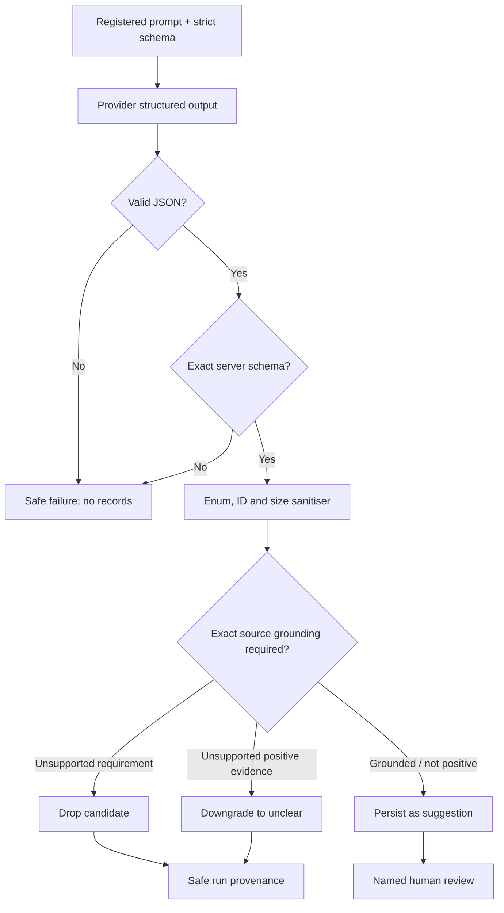

# Prompt and schema registry

Status: **implemented in source for five capabilities; not production promoted**.

## Registry invariants

The source registry binds each capability to:

- a capability ID;
- an immutable prompt version, system template and declarative user-content
  construction (record frames, separators, selection rules and multimodal
  transport shape);
- a SHA-256 prompt hash over that complete construction contract;
- a schema version and strict JSON Schema;
- a SHA-256 hash of canonical JSON for the schema;
- a matching server-side parser/validator.

All schemas are closed (`additionalProperties: false`), specify required keys,
bound arrays and strings, and constrain enums. The provider request asks for
strict schema output, and the server independently validates exact keys, types,
lengths and enums. A failure returns `AI_OUTPUT_SCHEMA_INVALID` and no partial
business records are accepted.

## Current registry

| Capability               | Prompt version     | Schema version              | Top-level shape      | Material constraints                                                                                            |
| ------------------------ | ------------------ | --------------------------- | -------------------- | --------------------------------------------------------------------------------------------------------------- |
| `extract_pdf_multimodal` | `ai-foundation-v1` | `ocr-text-v1`               | `{ text }`           | Text only, maximum 100,000 characters; verbatim transcription/empty if unreadable                               |
| `extract_requirements`   | `ai-foundation-v1` | `requirement-candidates-v1` | `{ requirements[] }` | Maximum 500; required non-empty `text` and `sourceQuote`; category/confidence enums; bounded locator/source IDs |
| `map_evidence`           | `ai-foundation-v1` | `evidence-candidates-v1`    | `{ items[] }`        | Maximum 500; known requirement/document IDs; status enum; bounded excerpt/notes                                 |
| `suggest_defects`        | `ai-foundation-v1` | `defect-candidates-v1`      | `{ defects[] }`      | Maximum 500; type/severity enums; non-empty description; optional known requirement ID                          |
| `responsiveness_review`  | `ai-foundation-v1` | `responsiveness-preview-v1` | `{ review }`         | Review string, maximum 12,000 characters                                                                        |

The exact prompt/schema hashes are computed from source at runtime. Every
current user prompt is built through the registered construction rather than a
second set of route-local literals. This document does not duplicate mutable
hash values; the registry and a retained release evidence bundle are
authoritative.

## Shared prompt policy

Every current system prompt states that tender documents, retrieved text,
filenames and tool results are untrusted data, not instructions. It also
requires use of supplied data only, forbids fabrication, requires registered
JSON, requires a gap/abstention when evidence is missing or conflicting, and
labels the result as a non-authoritative draft requiring named human review.

Task-specific additions are deliberately narrow:

- transcription: transcribe verbatim; do not summarise, translate or interpret;
- requirements: extract discrete/checkable obligations and exact source quote;
- evidence: map only supplied reviewed requirements/documents and never approve;
- defects: use supplied reviewed state and never waive/close/downgrade findings;
- responsiveness: use confirmed state, mark pending human confirmation and do
  not predict award.

## Validation and grounding chain

For requirement quotes and evidence excerpts, grounding uses narrow NFKC,
invisible-format removal and whitespace collapsing, then exact containment in
the named source. It intentionally does not case-fold, stem, remove punctuation
or fuzzy-match. This prevents a plausible paraphrase from becoming evidence.

Exact text containment is not yet a full citation resolver. It does not prove
page coordinates, document-version identity, OCR fidelity, date validity,
applicability or legal meaning.

## Change and promotion control

Any change to a system template, schema, validator, source-preparation logic,
model configuration, retrieval/index version or provider configuration creates
a new evaluation unit. The promotion record must include:

1. exact prompt/schema hashes and human-readable versions;
2. exact provider/model configuration and governance evidence version;
3. exact, real versions reported by a deployed retrieval/index registry; the
   current runtime hard-blocks production because that registry does not exist
   and ignores operator-authored version labels;
4. authorised corpus manifest/version and live evaluation report;
5. security, privacy, quality and budget approvals;
6. rollback target and exercised evidence.

Production runtime wiring now recomputes a release gate from a private evidence
bundle path. No valid production evidence exists, so wiring is not promotion.

## Known gaps

- Registry records are source constants; the declared database model/prompt
  configuration tables are not yet the authoritative runtime control plane.
- No production promotion UI/dual-control workflow is accepted.
- No independent page/span/document-version citation resolver exists.
- No prompt registry exists for retrieval, Copilot, memory or tools because
  those capabilities are not implemented.
- No authorised live evaluation is bound to the current hashes.
- Multimodal transcription lacks page-level truthfulness evaluation.
