# Retrieval and grounding design

Status: **target design only; no production retrieval/index is implemented**.

Current requirement extraction and evidence mapping send a complete, bounded
selected corpus. Inputs above 60,000 characters fail closed rather than being
sampled or truncated. Exact quotes/excerpts are checked against the named
document text. There is no embedding model, vector store, chunk index, reranker,
retrieval cache, retrieval memory or production citation resolver.

This document defines the boundary required if retrieval is later approved. It
must not be used as evidence that retrieval exists.

## 1. Design goals

- preserve document version, page/span and tenant identity through every stage;
- retrieve only authorised, active, in-scope material for one organisation and
  project/engagement;
- make citation resolution deterministic and independent of the model;
- treat indexed text and metadata as hostile data;
- expose empty/low-quality retrieval as abstention, not a guessed answer;
- make model, prompt, chunking, embedding, reranker and index changes evaluable;
- support deletion, reindexing and rollback without stale cache exposure.

## 2. Proposed data flow

```mermaid
flowchart LR
  O["Versioned source object"] --> V["Malware/type/hash verification"]
  V --> P["Versioned parse/OCR with page spans"]
  P --> C["Deterministic chunker"]
  C --> M["Tenant-scoped chunk manifest"]
  M --> E["Approved embedding provider or local model"]
  E --> I["Tenant-partitioned vector/lexical index"]

  Q["Authorised query + immutable tenant/project scope"] --> F["Server-side metadata filter"]
  F --> I
  I --> R["Bounded candidate set"]
  R --> K["Optional approved reranker"]
  K --> X["Deterministic source/version/span resolver"]
  X --> G["AI gateway as tainted context"]
  G --> Y["Strict-schema draft"]
  Y --> Z["Citation re-resolution + human review"]
```

## 3. Source and chunk identity

Each chunk should carry immutable:

- `organisation_id`, `project_id`/engagement ID and optional lot;
- object ID, document ID and document-version ID;
- object SHA-256 and parser/OCR run ID;
- page number, paragraph/table reference and optional coordinates;
- character/token offsets in the canonical page text;
- source snippet hash and chunk content hash;
- chunker, parser/OCR and redaction-policy versions;
- security/classification, active/deleted/quarantine state;
- embedding model/version, vector dimension and index version;
- created, superseded and deletion timestamps.

The model may cite opaque server aliases, but the server reconstructs and
authorises the real IDs. It never trusts a model-provided object path or tenant.

## 4. Query contract

The server supplies tenant and project/engagement scope from authenticated
state. Mandatory filters are applied before scoring and re-applied when results
are hydrated:

- exact organisation;
- exact project/engagement and allowed lot;
- active, non-quarantined, non-deleted version;
- permitted security/redaction classification;
- workflow-specific document type and validity window;
- index version bound to the release candidate.

Retrieval returns a bounded list of resolved spans with scores and provenance.
The model cannot request a broader scope, follow links, enumerate IDs or bypass
filters. Empty or below-threshold retrieval must return an explicit gap.

## 5. Hybrid retrieval and reranking

The proposed default is hybrid lexical plus vector candidate generation,
followed by an optional approved reranker. Technology and thresholds are not
selected. Before adoption, compare complete-corpus, lexical-only, vector-only
and hybrid approaches on the authorised corpus. Retrieval is justified only if
it improves measured recall/citation quality without unacceptable tenant,
privacy, latency or cost risk.

Do not use a shared vector collection with tenant filtering as the only
isolation control unless a two-tenant adversarial proof and vendor guarantees
are accepted. Prefer physical/index partitioning where proportionate.

## 6. Citation resolution

A cited claim is supportable only when the resolver can:

1. find the exact active document version and content hash;
2. locate the exact page/span/table coordinates;
3. confirm the quoted text occurs in canonical source text;
4. confirm the source remains in scope and authorised;
5. verify the output claim does not exceed what the cited span supports;
6. record resolver/index/retrieval versions and verification result.

Steps 1–4 are deterministic. Step 5 requires an independently labelled
evaluation and may still require human judgment. OCR-derived spans must carry
quality/verification status and must not silently become source truth.

## 7. Poisoning and injection controls

- Separate system instructions from every retrieved field.
- Mark document text, metadata and previous model output as tainted.
- Index only verified object versions; quarantine active content/malware.
- Detect duplicate/near-duplicate and conflicting source versions.
- Do not boost a chunk because it contains instructions to the model.
- Restrict metadata fields and lengths before indexing/provider disclosure.
- Re-authorise and re-resolve every returned chunk after vector lookup.
- Never let retrieved content select tools, recipients, URLs or data scope.
- Include filename, Unicode, table, image/OCR, metadata, cross-document and
  tool-result injection cases in behavioural tests.

## 8. Cache, deletion and reindexing

Cache keys must include organisation, project, user/role policy where relevant,
query hash, source manifest hash, retrieval policy, embedding/reranker and index
versions. Shared result caches without tenant scope are prohibited.

Deletion or source supersession must tombstone the source, invalidate caches,
remove lexical/vector entries, record completion evidence and prevent old
results from hydrating. Reindexing is idempotent and writes a new version before
atomic promotion; rollback selects a prior complete index, never a mixed one.

## 9. Required evaluation

Before production, retain:

- retrieval recall@k and precision@k on labelled spans by cohort;
- end-to-end requirement/evidence recall, precision and citation correctness;
- empty/ambiguous/conflicting-source abstention accuracy;
- cross-tenant tests for index, cache, hydration, reranking, queue and deletion;
- poisoning/injection behaviour with real PDF/OCR/table/image structures;
- index drift, stale-source, deleted-source and rollback tests;
- latency/token/cost slices and failure-mode results;
- exact version binding in the production release gate.

## 10. Delivery decision

Retrieval is deferred. The current bounded complete-corpus workflows may be
evaluated without it for documents within their limits. Do not add retrieval
only to avoid the input bound; first approve the architecture, data model,
provider/privacy posture, isolation tests and evaluation plan.
