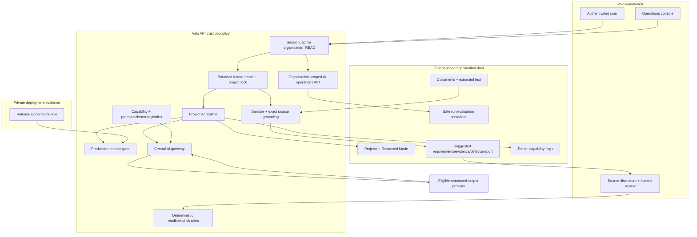
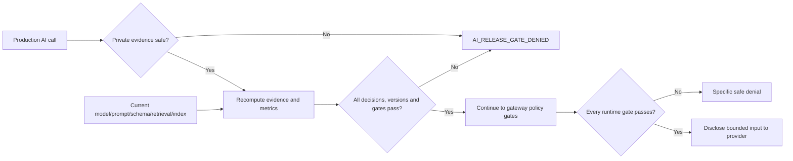

# Valo AI architecture

Status: **bounded gateway/runtime is implemented in source; target data and
operations planes are incomplete; production AI is disabled**.

## 1. Current implemented boundary

The working tree has five synchronous, project-scoped model workflows. Feature
routes call a shared project AI runtime. The runtime derives organisation and
Restricted Mode from the database, recomputes the production release gate and
passes immutable context into the central gateway. The gateway applies policy,
activation, model, budget, provider/privacy/region/retention/health, input and
cost gates before disclosure. It requests strict structured output, validates
usage/cost/schema, and returns a draft plus provenance.

Feature routes then sanitise IDs/enums/sizes, deterministically ground positive
source assertions and persist only suggestion-state output. Named reviewers—not
the model—establish authoritative workflow state.

No vector index, retrieval cache, AI memory, queue worker, AI outbox, Copilot or
general tool plane is present in this current path.

## 2. Production release boundary

Every production project AI call reads a private evidence file referenced by
`VALO_AI_RELEASE_EVIDENCE_PATH`. The runtime rejects a missing, relative,
symlink, empty, oversized, over-permissive (on non-Windows) or invalid file. It
recomputes the gate using the current model, prompt pack, schema-set hash,
retrieval version and index version. The gate separately verifies live
production-profile evaluation, authorised corpus, per-case/report consistency,
metrics, provider, privacy, budget and rollout decisions.

The release gate rejects missing and placeholder versions, including `none` and
`not_implemented`. Retrieval and index are not implemented/versioned, and no
valid production evidence bundle exists. Therefore production requests must
fail with `AI_RELEASE_GATE_DENIED`.

## 3. Target complete data plane

The target adds only after separate design approval:

1. immutable object/document versions and byte hashes;
2. versioned parser/OCR output with page spans and quality evidence;
3. deterministic chunks with tenant/project/version identity;
4. approved embeddings and tenant-partitioned lexical/vector indexes;
5. server-filtered retrieval and optional approved reranking;
6. independent document-version/span citation resolution;
7. transactional budget reservation/settlement and run provenance;
8. durable, idempotent job orchestration with cancellation/replay controls;
9. alerting, incident and deletion evidence.

The target does not imply approval of Copilot, long-term memory or general
tools. Those remain separate product/threat/evaluation scopes.

## 4. Trust boundaries and invariants

- Authentication/RBAC and object-level checks happen before model execution.
- Organisation/project scope is derived server-side and copied to every mutable
  tenant record.
- Model providers receive no DB, object-store, shell or arbitrary-network
  credentials.
- Uploaded text, OCR, metadata, retrieved chunks and tool results remain tainted
  data even when they look like instructions.
- Fallback is separately eligible and at least as protective as the primary.
- Strict schema plus independent server validation is mandatory.
- Exact text grounding is required for current positive source assertions; a
  future resolver must additionally prove version/page/span.
- Successful output without retained safe provenance is a failed run.
- AI creates drafts only and never advances project/release state.
- Restricted Mode denies the current externally hosted adapter.
- Caches, queues, retrieval and tools, if added, must carry immutable tenant
  scope and pass two-tenant negative tests.

## 5. Current failure behaviour

Missing or failed release, activation, model, budget, provider governance,
region, retention, Restricted Mode, health, usage, cost or schema evidence
returns a safe denial. No partial model output may persist. Manual workflows
remain the recovery path.

Cancellation is checked before disclosure and after provider completion. A
provider may not guarantee revocation after accepting a request, so feature
routes retain their tenant/project lock or hold until the attempt settles.

## 6. Remaining architectural blockers

- missing source-document versions (Business Plan v1.2/Roadmap v1.1);
- provider, region/residency, retention/DPA and budget decisions;
- real versioned retrieval/index components required by the current gate;
- independent citation/claim resolver and page-level OCR truthfulness proof;
- concurrency-safe budget and authoritative promotion/run ledgers;
- durable AI jobs/outbox and their isolation semantics if adopted;
- operational alerting, provider health semantics and incident ownership;
- authorised live evaluation and staged rollout evidence.
