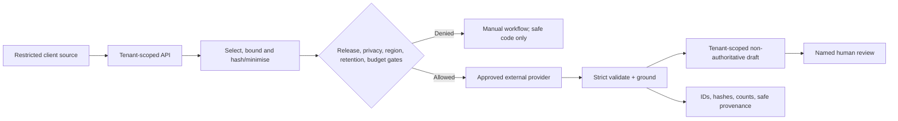

# AI threat and privacy model

Status: **source controls implemented in part; production assurance incomplete**.

Client tender, bid, evidence, personnel and commercial content is Restricted.
It must not enter shared training or ordinary logs. Evaluation use requires a
separate recorded basis, minimisation, pseudonymous metadata, tenant-isolated
storage, retention/deletion rules and reviewer authorisation.

## Threat/control matrix

| Threat                                     | Current control in source                                                                              | Remaining proof/blocker                                                                     |
| ------------------------------------------ | ------------------------------------------------------------------------------------------------------ | ------------------------------------------------------------------------------------------- |
| Direct/indirect prompt injection           | Instruction/data separation, closed schemas, exact validators, sanitisation and external policy checks | Behavioural authorised PDF/OCR/table/image/retrieval/tool suite absent                      |
| Filename/metadata/Unicode/table injection  | Structural taxonomy; narrow Unicode source normalisation; bounded fields                               | Live parser/provider behaviour and obfuscated real-file proof absent                        |
| Retrieval poisoning                        | Retrieval absent; design requires trust state, tenant filters and post-hydration reauthorisation       | Pipeline, index and poisoning evaluation not implemented                                    |
| Tool-result poisoning/replay               | No model tool plane; provider contract only                                                            | Future tools prohibited until typed auth/idempotency/ledger tests exist                     |
| Cross-tenant context/cache leak            | Runtime derives tenant from project; RLS/schema foundations; operations queries active organisation    | Full two-tenant DB/storage/provider/export and future cache/retrieval/queue/tool E2E absent |
| Hallucinated requirement citation          | Non-empty quote plus exact containment in named selected source; release rechecks stored quote         | Immutable document-version/page/span resolver, OCR truth and live citation score absent     |
| Hallucinated evidence                      | Unsupported `present`/`expired` becomes `unclear`; reviewed source required downstream                 | Validity/applicability/claim-support adjudication and render/export proof incomplete        |
| OCR omission/fabrication                   | Verbatim-only transcription schema and manual-review posture                                           | Page-level labelled truthfulness/completeness evaluation absent                             |
| Autonomous state change                    | Level-2 draft-only policy; no AI project transitions; suggestion states                                | Complete unauthorised-action/concurrency/replay E2E pending                                 |
| Budget denial of service                   | Per-run input/output/cost/retry/fallback ceilings and approved-budget checks                           | Monthly/tenant/engagement limit decision and transactional concurrent ledger absent         |
| Provider retention/cross-border processing | Pre-disclosure governance, region, retention, Restricted Mode and fallback checks                      | Provider/DPA/DPIA/residency/deletion/no-training decisions not approved                     |
| Sensitive telemetry                        | Input hash, counts, bounded provenance, safe error taxonomy, organisation-scoped operations view       | Canary scan, retention/deletion and target log/export audit absent                          |
| Unsafe release evidence                    | Private absolute regular file, size/permission checks, recomputed versions/metrics/decisions           | Integrity/signing/rotation/owner process and valid production bundle absent                 |
| Supply-chain/model drift                   | Pinned model/config, prompt/schema hashes and release version matching                                 | Provider alias/version immutability, dependency review and live drift alerts pending        |
| Availability/cancellation ambiguity        | Bounded timeout/retry, cancellation checks, tenant hold until provider settles                         | Production provider semantics, load/failure testing and operational recovery proof pending  |

## Data-flow privacy boundaries

The current OpenAI adapter sets `store: false` and requires asserted governance
evidence in production, but an environment assertion is not legal/technical
proof. The adapter is externally hosted and explicitly ineligible for
Restricted Mode. No provider, region, retention or DPA decision is approved in
this work.

## Prompt-injection security model

Prompt text is defence-in-depth, not the trust boundary. The enforcement chain
is server authorisation, immutable scope, bounded data preparation, registered
system prompt and closed schema, independent validation/sanitisation, source
grounding, suggestion-state persistence and named review. A malicious document
cannot expand data scope, select a tool, approve itself or change a project.

Structural fixture success does not prove behavioural safety. Production tests
must include instruction-like filenames, hidden Unicode, white-on-white text,
PDF layers, QR/image text, table cells, OCR hallucination, addenda, conflicting
documents, metadata, model-output replay and—for future retrieval/tools—poisoned
chunks/results.

## Privacy decisions required

- lawful/contractual basis and purpose for each capability and evaluation use;
- provider legal entity, DPA, subprocessors and transfer mechanism;
- processing region/residency and failover route;
- no-training verification and any abuse-monitoring retention;
- retention/deletion for provider, application runs, drafts, evaluations,
  incidents, backups and future indexes/caches;
- Restricted Mode/manual-processing policy;
- redaction/minimisation and special-category/personal data handling;
- data-subject/customer notice and contract commitments;
- DPIA approval, review/expiry date and incident contacts.

Synthetic adversarial cases must be labelled synthetic and cannot substitute
for representative authorised holdout coverage. A DPIA, provider decision,
residency/retention decision and deletion test remain production blockers.
