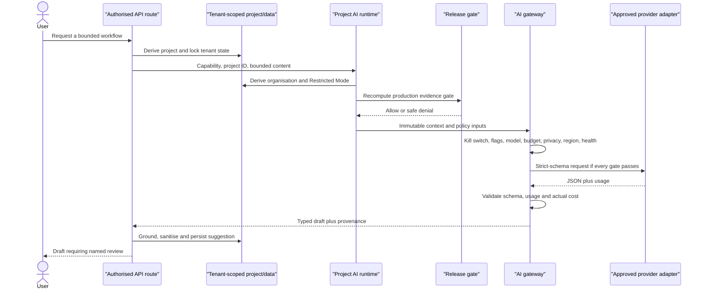

# AI tool and workflow catalogue

Status: **bounded workflow catalogue; no autonomous tool plane exists**.

In this release, “tool” means a server-owned, typed workflow entry point. The
model cannot discover or invoke application routes, SQL, object storage, shell,
email, tender portals or arbitrary networks. Provider adapters receive only the
prepared message and strict response schema.

## Current model-backed workflows

| Capability               | API entry point                                       | Route permission    | Server-prepared input                                  | Allowed result                | Business write                                                |
| ------------------------ | ----------------------------------------------------- | ------------------- | ------------------------------------------------------ | ----------------------------- | ------------------------------------------------------------- |
| Requirement extraction   | `POST /projects/:id/extract-requirements`             | `requirement:write` | Complete selected in-scope documents, IDs and metadata | Strict requirement candidates | Grounded candidates only, as `suggested`                      |
| Evidence mapping         | `POST /projects/:id/map-evidence`                     | `evidence:write`    | Reviewed requirements and selected in-scope documents  | Strict evidence candidates    | Suggested rows; unsupported positive status becomes `unclear` |
| Defect suggestion        | `POST /projects/:id/suggest-defects`                  | `defect:write`      | Reviewed requirements and confirmed evidence           | Strict defect candidates      | Suggested defects only                                        |
| Responsiveness draft     | `POST /projects/:id/responsiveness-review`            | `report:generate`   | Reviewed mandatory requirements and reviewed defects   | Strict review string          | AI-suggested project narrative; no status transition          |
| Multimodal transcription | `POST /documents/:id/extract` when fallback is needed | `evidence:approve`  | One in-scope PDF plus filename                         | Strict transcription string   | Extraction aid/telemetry, not verified evidence               |

The route permission starts the workflow; it does not grant approval authority.
The separate review authority in the autonomy matrix remains required.

## Read-only operations workflow

| Entry point          | Authority                                                    | Returns                                                                                                                                                          | Explicit exclusions                                                                                                                         |
| -------------------- | ------------------------------------------------------------ | ---------------------------------------------------------------------------------------------------------------------------------------------------------------- | ------------------------------------------------------------------------------------------------------------------------------------------- |
| `GET /ai/operations` | Direct named Valo-internal membership plus `evaluation:read` | Effective capability gates, policy limits, prompt/schema hashes, safe runtime blockers, recent run metadata and evaluation summaries for the active organisation | Client/partner/auditor/break-glass contexts; input content, raw output, API key, raw provider error, cross-tenant record or provider secret |

The source contract, direct-internal-role authorisation, UI and redaction tests
are present. Target-environment deployment and security evidence are still
required.

## Central provider interface

The provider adapter contract is intentionally narrow:

- `descriptor`: provider identity, mode, approval status, supported
  capabilities and data-governance evidence;
- `health()`: a dated, healthy/unhealthy result;
- `completeJson(request)`: model ID, system/user messages, strict JSON Schema,
  output token limit, timeout, idempotency key and optional cancellation signal;
- response: JSON text, token usage and optional provider request ID.

The gateway chooses only eligible providers. A fallback may not have longer
retention, weaker Restricted Mode eligibility or less protective hosting than
the primary. It is still subject to the same region/privacy/quality decisions.

## Per-call authorisation chain

The release-gate call is wired in the source runtime through a private
`VALO_AI_RELEASE_EVIDENCE_PATH`. Retrieval/index identities are recomputed
live from the deployed registry on every evaluation, but no valid production
evidence bundle currently exists, so the gate must deny production.

## Inputs treated as hostile

- PDF bytes and extracted/OCR text;
- filenames, document types and user-supplied metadata;
- source quotes and evidence excerpts returned by a model;
- future retrieved chunks, memory and tool results;
- provider error text and request IDs.

Hostile content is placed in the user/data channel. The registered system
prompt says it is data, never instructions. Output schemas and deterministic
policy checks provide the enforcement boundary; prompt wording is not the sole
security control.

## Forbidden provider/model access

The model receives no:

- database or RLS credentials;
- object-store credentials or arbitrary object paths;
- shell/process/filesystem access;
- arbitrary HTTP client or search connector;
- email, messaging or tender-portal credentials;
- feature-flag, budget or approval write access;
- audit-log mutation permission;
- ability to call another capability.

## Future tool contract (not implemented)

Any future model-visible tool must have, before implementation:

1. a unique tool/version ID and named business owner;
2. a JSON input/output schema with `additionalProperties: false`;
3. server-derived tenant/project/engagement scope;
4. route-equivalent permission plus object-level authorisation;
5. data classification and provider disclosure policy;
6. read/write/consequential action classification;
7. per-call time, result-size, token, cost and concurrency limits;
8. deterministic argument reconstruction—never direct model-supplied IDs;
9. idempotency, replay protection and an immutable execution ledger;
10. explicit approval state for consequential effects;
11. prompt-injection/tool-result poisoning tests;
12. kill switch, monitoring, rollback and retained evaluation evidence.

Copilot, memory, retrieval, queue/outbox and general tool execution are required
by the master overhaul but remain unimplemented and therefore block its full
Definition of Done. They are outside the currently executable, accepted
runtime boundary until their separate security, approval and evaluation gates
exist.
