# TRD and roadmap update

Status: **proposed update against TRD v1.0 and Roadmap v1.0**.

The requested Business Plan v1.2 and Product Roadmap v1.1 were not available.
This update must be reconciled against them before formal baseline approval.

## 1. Technical delta

The current working tree moves the five model-backed request/response workflows
toward a shared control plane:

- a formal Level-2 capability/autonomy policy;
- a central project-scoped AI runtime and gateway;
- strict prompt/schema registration and deterministic hashes;
- provider governance, region, retention, health and fallback checks;
- capability and global server-side gates;
- conservative per-run budget checking;
- exact source quote/excerpt grounding for positive suggestions;
- safe run provenance and an organisation-scoped operations API;
- a production-profile evaluation/release-gate contract.

This is source-level implementation, not an operationally accepted deployment.
Retrieval, durable AI orchestration, Copilot, memory, tool execution, shadow
traffic and canary automation remain unimplemented.

## 2. Component status

| Component               | Current state                                                 | Production exit criterion                                                   |
| ----------------------- | ------------------------------------------------------------- | --------------------------------------------------------------------------- |
| Capability policy       | Implemented and unit-tested in source                         | Owner approval; deployed gate exercise                                      |
| Prompt/schema registry  | Implemented for five tasks                                    | Exact production configuration promoted after live eval                     |
| AI gateway/runtime      | Integrated in working tree                                    | Full integration/security/load testing and deployed smoke proof             |
| OpenAI adapter          | Strict structured-output/provider contract in source          | Provider/DPA/region/retention approval and live conformance proof           |
| Source grounding        | Exact quote/excerpt containment in current workflows          | Independent version/locator resolver and authorised citation score          |
| Suggestion review       | Existing requirement/evidence/defect/report controls hardened | Full unauthorised-action and concurrency/replay E2E                         |
| AI operations API       | Organisation-scoped source exists                             | UI/contract/security tests, alert integration and deployed validation       |
| Evaluation harness      | Production profile and manifest validator exist               | At least 25 authorised adjudicated holdout cases and retained live run      |
| Retrieval/index         | Design only                                                   | Built, versioned, isolated and evaluated                                    |
| Durable AI queue/outbox | Not implemented                                               | Idempotent jobs, leases, cancellation, replay and transaction boundary      |
| Copilot/memory/tools    | Required by the master scope but not implemented              | Product/security approval, scoped data plane, implementation and evaluation |

## 3. Target delivery sequence

```mermaid
flowchart LR
  P0["P0: freeze requirements and decisions"] --> P1["P1: complete gateway integration and tests"]
  P1 --> P2["P2: authorised corpus and citation resolver"]
  P2 --> P3["P3: offline production-profile evaluation"]
  P3 --> P4["P4: no-output shadow"]
  P4 --> P5["P5: internal reviewer pilot"]
  P5 --> P6["P6: selected-tenant pilot"]
  P6 --> P7["P7: bounded canary"]
  P7 --> P8["P8: production decision"]
```

No phase is calendar-driven. Advancement requires retained exit evidence.

## 4. Roadmap work packages

### P0 — Requirements and governance freeze

Deliver:

- reconcile Business Plan v1.2 and Roadmap v1.1;
- approve capability owners and autonomy matrix;
- decide provider(s), legal entity, DPA, subprocessors, no-training evidence,
  processing region, retention/deletion and Restricted Mode policy;
- approve monthly, tenant, engagement and per-run budgets and rate card;
- complete DPIA and data-classification/retention decisions.

Exit: every decision has a named owner, reference, effective date and expiry.

### P1 — Bounded runtime completion

Deliver:

- finish integration and route/OpenAPI/client contract validation;
- ensure all five routes use only the central runtime;
- add concurrent budget reservation/settlement rather than relying only on an
  environment-provided remaining balance;
- prove output/provenance persistence is atomic or fails closed;
- prove kill switch and capability flag behaviour under concurrency;
- complete AI operations UI and authorisation/redaction tests.

Exit: no direct provider path, no partial authoritative write, and complete
source/contract/security tests pass in a production-like environment.

### P2 — Grounding and authorised evaluation data

Deliver:

- build a document-version/span citation resolver with page/paragraph/table
  coordinates and source hashes;
- assemble at least 25 authorised, pseudonymised, adjudicated holdout cases;
- include native, scanned, long, table-heavy, multiple-lot, BPP-style,
  NipeX/NCDMB, donor/addendum and negative cohorts;
- add page-level OCR truthfulness labels and behavioural prompt-injection cases.

Exit: corpus validator passes the production contract and reviewers approve the
annotation report. The current release gate still requires real pinned
retrieval and index versions; complete-corpus evaluation may inform a later
architecture decision but cannot bypass that gate.

### P3 — Offline promotion candidate

Deliver a live run bound to exact provider/model configuration, prompt/schema,
real pinned retrieval/index versions, corpus and code release. The current gate
rejects placeholders such as `none` and therefore requires those components to
be implemented and versioned before this release can pass. Record quality,
cohort slices, latency, tokens, cost, limitations and every failure.

Exit: every production threshold passes with no fatal miss or unsupported
claim, and security/privacy/cost owners approve the candidate.

### P4 — Shadow

Use explicitly authorised traffic. AI results are not shown to users and do not
write business records. Compare to human workflow outcomes; scan logs for
canary content; exercise provider outage, kill switch and alert delivery.

Exit: stop thresholds remain clear and no privacy, tenant, quality or budget
breach occurs.

### P5/P6 — Reviewer and tenant pilots

Expose suggestions only to named reviewers, first internally and then to
selected tenants/capabilities. Capture acceptance, edits, rejection reasons,
grounding failures, completion time, incidents and cost. Pilot participation is
not blanket consent for evaluation reuse.

Exit: reviewers understand provenance/limits; correction and safety thresholds
pass; support and incident coverage are ready.

### P7 — Canary

Enable a small, pre-approved traffic fraction with automatic stop criteria for
schema failure, provider/privacy drift, tenant denial, fatal miss, unsupported
claim, citation failure, budget/latency breach, alert failure or unusual
reviewer correction.

Exit: retained canary and rollback evidence; named owner signs the final
acceptance matrix.

### P8 — General availability decision

GA is a decision, not an automatic phase transition. Enable only the exact
capabilities, tenants, provider/model/prompt/schema and data path that passed.
Copilot, retrieval, memory or tools added later require a new evaluation and
threat-model revision.

## 5. Architecture decision records still required

| ADR        | Decision                                          | Current status            |
| ---------- | ------------------------------------------------- | ------------------------- |
| ADR-AI-001 | Approved provider and fallback                    | Pending                   |
| ADR-AI-002 | Processing region and data residency              | Pending                   |
| ADR-AI-003 | Retention, no-training and deletion evidence      | Pending                   |
| ADR-AI-004 | Budget currency, monthly/tenant/engagement limits | Pending                   |
| ADR-AI-005 | Citation resolver and document version authority  | Pending                   |
| ADR-AI-006 | Retrieval necessity and technology                | Deferred; not implemented |
| ADR-AI-007 | Durable job/outbox architecture                   | Deferred; not implemented |
| ADR-AI-008 | Production SLOs, paging and on-call ownership     | Pending                   |

## 6. Roadmap constraints

- Do not enable production AI to meet a date.
- Do not treat synthetic regression fixtures as customer-data validation.
- Do not treat an environment variable, API key or provider default as an
  approval record.
- Do not add a Copilot, memory or general tool plane under the current release
  gate; each materially expands the threat and privacy boundary.
- Do not claim production retrieval isolation while retrieval is absent.
