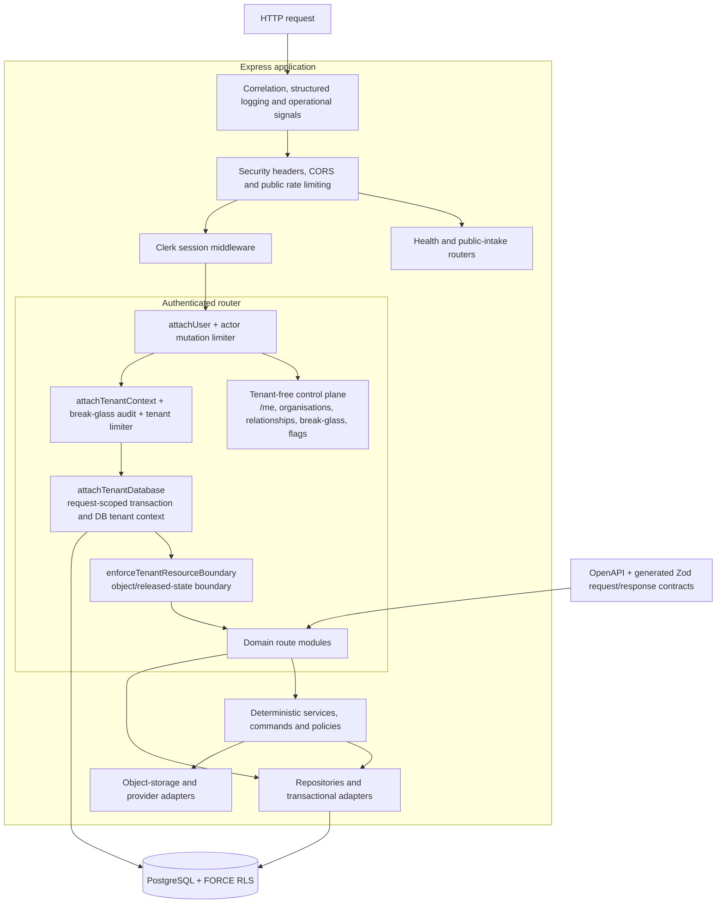
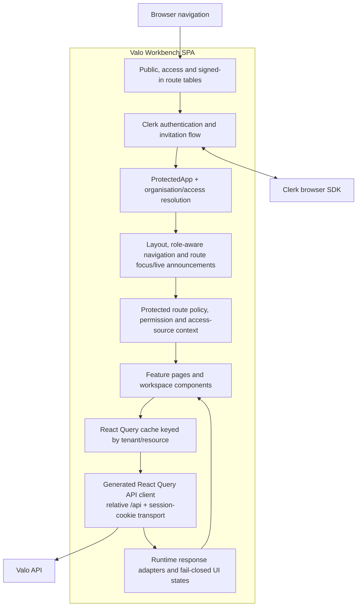

# C4 level 3 — selected components

**Current:** These views describe the current API ingress/tenant pipeline and Workbench shell/transport boundaries.

**Target:** Domain modules should converge on explicit route → service/command → repository boundaries with enforceable dependency rules.

**Deployed:** Components are bundled into the configured Node/Workbench artefacts; their presence does not prove a live deployment.

**Verified:** Typechecking, route-order/static contracts, integration tests, generated-client parity, and UI tests cover selected components. Coverage is linked, not implied for every path.

Last reviewed: **2026-08-31**

## API components

### API component responsibilities

| Component                    | Responsibility                                                                                                                                                        | Source evidence                                                                                                                                                                                                                                   |
| ---------------------------- | --------------------------------------------------------------------------------------------------------------------------------------------------------------------- | ------------------------------------------------------------------------------------------------------------------------------------------------------------------------------------------------------------------------------------------------- |
| Application edge             | Correlation IDs, privacy-safe logging, signals, CORS, public abuse control, payload limits, and Clerk placement.                                                      | [`app.ts`](../../artifacts/api-server/src/app.ts), [`security.ts`](../../artifacts/api-server/src/middlewares/security.ts), [`observability.ts`](../../artifacts/api-server/src/lib/observability.ts)                                             |
| Authenticated control plane  | Resolve local user and allow only explicitly tenant-free discovery/administration flows before tenant selection.                                                      | [`routes/index.ts`](../../artifacts/api-server/src/routes/index.ts), [`auth.ts`](../../artifacts/api-server/src/middlewares/auth.ts)                                                                                                              |
| Tenant access pipeline       | Resolve one active access context, enforce durable rate limits, hold a tenant transaction, set database context, and reject cross-resource or immutable-state access. | [`tenancy.ts`](../../artifacts/api-server/src/middlewares/tenancy.ts), [`databaseTenancy.ts`](../../artifacts/api-server/src/middlewares/databaseTenancy.ts)                                                                                      |
| Inward authority contract    | Give domain/application code a transport-neutral, server-resolved `LocalUser` and `AccessContext`; Express middleware attaches rather than owns the contract.         | [`accessContext.ts`](../../artifacts/api-server/src/lib/accessContext.ts), with middleware consumers in [`auth.ts`](../../artifacts/api-server/src/middlewares/auth.ts) and [`tenancy.ts`](../../artifacts/api-server/src/middlewares/tenancy.ts) |
| Domain route modules         | Parse transport input, apply permissions, call deterministic policy/service/repository logic, and return bounded errors.                                              | [`routes/`](../../artifacts/api-server/src/routes/)                                                                                                                                                                                               |
| Domain services and policies | Keep closed state machines, deterministic calculations, authority rules, provenance, and adapter-neutral behavior away from presentation.                             | [`lib/`](../../artifacts/api-server/src/lib/)                                                                                                                                                                                                     |
| Persistence boundary         | Drizzle schema/queries, migrations, transaction helpers, RLS/startup attestation, and least-privilege runtime configuration.                                          | [`lib/db`](../../lib/db/)                                                                                                                                                                                                                         |
| Contract boundary            | Define HTTP shape once, generate clients/validators, and reject drift.                                                                                                | [`openapi.yaml`](../../lib/api-spec/openapi.yaml), [`api-client-react`](../../lib/api-client-react/), [`api-zod`](../../lib/api-zod/)                                                                                                             |
| Storage/provider boundary    | Convert provider behavior into bounded typed contracts; apply activation and reconciliation rules.                                                                    | [`objectStorage.ts`](../../artifacts/api-server/src/lib/objectStorage.ts), [`providerContracts.ts`](../../artifacts/api-server/src/lib/providerContracts.ts), [`integrations-openai-ai-server`](../../lib/integrations-openai-ai-server/)         |

Some older/large routes still combine transport, policy, query, and assembly logic. The diagram is the intended current boundary model, not a claim that every route has completed that decomposition. See [component map](COMPONENT_MAP.md) and [risk register](RISK_REGISTER.md).

The machine-checked [route-policy catalogue](../../config/architecture/route-policies.v1.json) records defaults and exact high-risk overrides. It complements middleware order and focused route tests; it does not itself enforce a request.

## Workbench components

### Workbench component responsibilities

| Component                         | Responsibility                                                                                                                                           | Source evidence                                                                                                                                                                                                                                                                                                      |
| --------------------------------- | -------------------------------------------------------------------------------------------------------------------------------------------------------- | -------------------------------------------------------------------------------------------------------------------------------------------------------------------------------------------------------------------------------------------------------------------------------------------------------------------- |
| Route tables                      | Separate public, access, and signed-in surfaces and preserve a clear URL-level information architecture.                                                 | [`App.tsx`](../../artifacts/valo-workbench/src/App.tsx), [`route-classification.ts`](../../artifacts/valo-workbench/src/lib/route-classification.ts), [`access-routes.tsx`](../../artifacts/valo-workbench/src/access-routes.tsx), [`protected-routes.tsx`](../../artifacts/valo-workbench/src/protected-routes.tsx) |
| Authentication/organisation gate  | Wait for Clerk, load `/me`, require an active selected organisation where needed, and render truthful retry/access states.                               | [`protected-app.tsx`](../../artifacts/valo-workbench/src/protected-app.tsx), [`contexts/`](../../artifacts/valo-workbench/src/contexts/)                                                                                                                                                                             |
| Layout and accessibility boundary | Provide navigation, role/access visibility, route titles, focus management, and live announcements.                                                      | [`layout.tsx`](../../artifacts/valo-workbench/src/components/layout.tsx), [`protected-route-accessibility.tsx`](../../artifacts/valo-workbench/src/components/protected-route-accessibility.tsx)                                                                                                                     |
| Route policy context              | Derive presentation-level route policy, access-source restrictions, and help content without pretending to grant server authority.                       | [`protected-route-context.ts`](../../artifacts/valo-workbench/src/lib/protected-route-context.ts)                                                                                                                                                                                                                    |
| Feature pages/components          | Present review, evidence, operations, delivery, privacy, commercial, and administrative workflows.                                                       | [`pages/`](../../artifacts/valo-workbench/src/pages/), [`components/`](../../artifacts/valo-workbench/src/components/)                                                                                                                                                                                               |
| Query/client boundary             | Use generated operations and tenant-aware cache keys; bind caches to identity, clear them on authority change, and invalidate only affected projections. | [`api-client-react`](../../lib/api-client-react/), [`authenticated-gateway.tsx`](../../artifacts/valo-workbench/src/authenticated-gateway.tsx), [`organisation-context.tsx`](../../artifacts/valo-workbench/src/contexts/organisation-context.tsx)                                                                   |
| Runtime adapters                  | Treat malformed, unavailable, empty, and denied responses as distinct states and never infer authority from missing data.                                | Feature adapters under [`src/lib`](../../artifacts/valo-workbench/src/lib/) and component tests                                                                                                                                                                                                                      |

## Component rules

1. UI checks reduce guaranteed-denial requests and improve explanation; they never replace server permission checks.
2. Route modules should depend on domain contracts/services, not let presentation input become authority.
3. Domain/application code depends on the inward `lib/accessContext.ts` authority contract; it must not import HTTP middleware to obtain actor or tenant types.
4. Cross-domain writes should use explicit commands/repositories and one transaction where invariants span records.
5. Generated outputs are changed through OpenAPI/code generation, not hand-maintained as independent contracts.
6. Provider, storage, and worker components expose bounded capabilities; missing activation fails closed.
7. A component view must identify mixed or incomplete decomposition rather than laundering a target boundary into a current claim.
