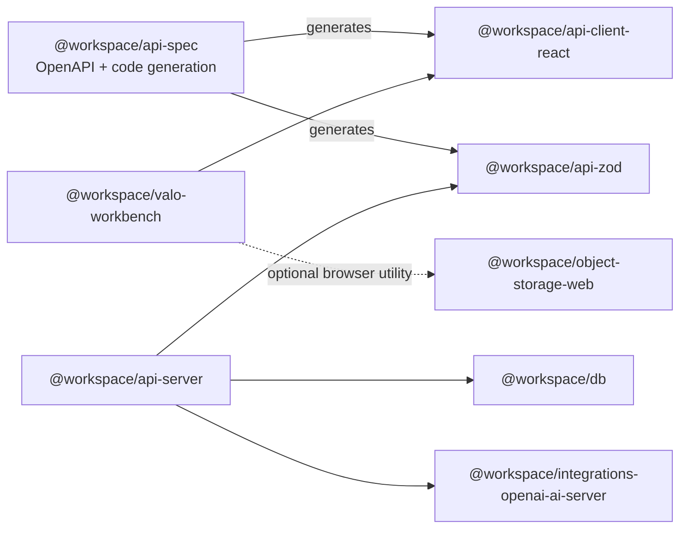

# Component-to-code map

**Current:** This map locates the principal components; executable catalogues enforce the workspace graph, four coarse internal source boundaries, reviewed hotspot budgets, and selected route-policy classifications.

**Target:** Delivery, intelligence, retention, commercial, and communication domains should gain finer dependency rules only as measured ownership/change pressure justifies safe extraction.

**Deployed:** Paths identify source components, not independently deployed services.

**Verified:** The architecture fitness gate compares workspace manifests and source imports to an acyclic allowlist, checks relative imports across API lib/middleware/routes and Workbench source, rejects stale exceptions, and measures line-budget hotspots. The domain rows below remain responsibility guidance rather than separately enforced modules.

Last reviewed: **2026-08-31**

## Workspace dependency direction

`api-spec` is a build-time source rather than a runtime import of the generated packages. The architecture verifier checks every discovered `@workspace` package declaration and source import against this allowlisted direction; TypeScript project references still define the exact compile graph.

The executable [module-boundary catalogue](../../config/architecture/module-boundaries.v1.json) defines the measured package roots, permitted dependency edges, line-budget policy, and explicitly reviewed hotspot exceptions. This document supplies the human responsibility map.

## Platform component map

| Component                        | Primary code                                                                                                                                                                                                                                                                                                                    | Owns / decides                                                                                                  | Allowed principal dependencies                                                          | Boundary notes                                                                                                                                                                    |
| -------------------------------- | ------------------------------------------------------------------------------------------------------------------------------------------------------------------------------------------------------------------------------------------------------------------------------------------------------------------------------- | --------------------------------------------------------------------------------------------------------------- | --------------------------------------------------------------------------------------- | --------------------------------------------------------------------------------------------------------------------------------------------------------------------------------- |
| Application composition          | [`artifacts/api-server/src/app.ts`](../../artifacts/api-server/src/app.ts), [`routes/index.ts`](../../artifacts/api-server/src/routes/index.ts)                                                                                                                                                                                 | Global middleware order, public/protected mount order, concrete router/repository composition.                  | Middleware, route factories, observability.                                             | Composition is the only place that should choose concrete default adapters for the integrated app.                                                                                |
| Identity and tenant access       | Inward [`lib/accessContext.ts`](../../artifacts/api-server/src/lib/accessContext.ts), [`middlewares/auth.ts`](../../artifacts/api-server/src/middlewares/auth.ts), [`tenancy.ts`](../../artifacts/api-server/src/middlewares/tenancy.ts), [`databaseTenancy.ts`](../../artifacts/api-server/src/middlewares/databaseTenancy.ts) | Local-user resolution, organisation/access source, roles/permissions, tenant transaction and resource boundary. | Domain-owned access/permission contracts, DB access helpers, audit/rate-limit controls. | Client-supplied actor/tenant identity is never authoritative. The gate now verifies that lib cannot depend on middleware/routes; `accessContext.ts` is the inward authority seam. |
| HTTP contracts                   | [`lib/api-spec/openapi.yaml`](../../lib/api-spec/openapi.yaml), generated [`api-client-react`](../../lib/api-client-react/) and [`api-zod`](../../lib/api-zod/)                                                                                                                                                                 | Operation shapes, public schemas, documented errors, generated client/validator parity.                         | Orval/codegen tooling only.                                                             | Generated files are outputs. A deterministic patch step covers generator limitations and is drift-tested.                                                                         |
| Engagement and compliance        | [`routes/projects.ts`](../../artifacts/api-server/src/routes/projects.ts), [`requirements.ts`](../../artifacts/api-server/src/routes/requirements.ts), [`evidence.ts`](../../artifacts/api-server/src/routes/evidence.ts), [`defects.ts`](../../artifacts/api-server/src/routes/defects.ts)                                     | Project state, cited requirements, evidence review, defect state, readiness inputs.                             | Tenant/permission boundary, DB, deterministic policy, audit.                            | Several routes still access the shared DB package directly; transaction and ownership rules require careful review.                                                               |
| Reports and governed packages    | [`routes/reports.ts`](../../artifacts/api-server/src/routes/reports.ts), [`lib/projectExportPackage.ts`](../../artifacts/api-server/src/lib/projectExportPackage.ts), [`lib/projectExportArchive.ts`](../../artifacts/api-server/src/lib/projectExportArchive.ts)                                                               | Report sign-off, exact export confirmation, immutable package manifest/provenance, download audit.              | Compliance/evidence reads, DB transaction, object storage, audit.                       | High-risk concurrency boundary; see [dynamic flow](DYNAMIC_FLOWS.md#report-sign-off-and-concurrent-revocation).                                                                   |
| Delivery Studio                  | [`routes/deliveryStudio.ts`](../../artifacts/api-server/src/routes/deliveryStudio.ts), [`lib/deliveryStudio`](../../artifacts/api-server/src/lib/deliveryStudio/), [Workbench Delivery Studio](../../artifacts/valo-workbench/src/pages/project-tabs/delivery-studio-tab.tsx)                                                   | Draft/review/red-team/package/rehearsal workflows and source-snapshot bindings.                                 | Project/report/package state, DB guards, generated contracts.                           | Database functions/triggers enforce released-source invariants in addition to application checks.                                                                                 |
| Tender intelligence              | [`routes/tenderContext.ts`](../../artifacts/api-server/src/routes/tenderContext.ts), [`lib/intelligence`](../../artifacts/api-server/src/lib/intelligence/), [Tender Context route](../../artifacts/valo-workbench/src/pages/tender-context-route.tsx)                                                                          | Source-grounded deterministic intelligence and governed selector metadata.                                      | Project documents/evidence/rule packs, DB, generated contracts.                         | Model execution is not implied by an intelligence label.                                                                                                                          |
| Operations and growth            | [`routes/operationsSuite.ts`](../../artifacts/api-server/src/routes/operationsSuite.ts), [`lib/operationsSuite`](../../artifacts/api-server/src/lib/operationsSuite/), [`routes/growthSuite.ts`](../../artifacts/api-server/src/routes/growthSuite.ts)                                                                          | Work, request, war-room, QA, post-award, lead, onboarding, and offer records.                                   | Tenant/permission boundary, repositories, audit, package references.                    | External messages, submissions, payments, and autonomous actions remain absent or disabled.                                                                                       |
| Privacy, retention and assurance | [`lib/privacyOperationsCentre`](../../artifacts/api-server/src/lib/privacyOperationsCentre/), [`lib/retentionCompletion`](../../artifacts/api-server/src/lib/retentionCompletion/), [`lib/productionAcceptance`](../../artifacts/api-server/src/lib/productionAcceptance/)                                                      | Privacy evidence workflows, two-phase deletion proof, release/recovery evidence snapshots.                      | Direct-membership gates, DB/RLS, audit, activation manifests.                           | Evidence recording does not execute legal, deletion, recovery, or deployment decisions.                                                                                           |
| Durable execution                | [`lib/durableWorkerFoundation.ts`](../../artifacts/api-server/src/lib/durableWorkerFoundation.ts), [`lib/transactionalOutbox.ts`](../../artifacts/api-server/src/lib/transactionalOutbox.ts)                                                                                                                                    | Job admission, leases/fences, attempts, dead letter, content-free outbox intent.                                | DB, allowlisted handlers/adapters when activated.                                       | Worker control is intentionally unmounted; see [worker flow](DYNAMIC_FLOWS.md#durable-worker-and-outbox-target-flow).                                                             |
| Provider and storage adapters    | [`lib/providerContracts.ts`](../../artifacts/api-server/src/lib/providerContracts.ts), [`lib/objectStorage.ts`](../../artifacts/api-server/src/lib/objectStorage.ts), [`lib/integrations-openai-ai-server`](../../lib/integrations-openai-ai-server/)                                                                           | Typed capability, error, health, privacy, timeout, and reconciliation boundaries.                               | Approved SDKs and environment configuration.                                            | Direct provider calls should not spread through routes.                                                                                                                           |
| Database and runtime security    | [`lib/db/src`](../../lib/db/src/), [`lib/db/migrations`](../../lib/db/migrations/)                                                                                                                                                                                                                                              | Schema, migration journal, RLS/trigger/function/ACL contracts, pool/runtime identity.                           | PostgreSQL/Drizzle only.                                                                | Migration-owner and runtime identities are deliberately separate.                                                                                                                 |
| Workbench shell                  | [`protected-app.tsx`](../../artifacts/valo-workbench/src/protected-app.tsx), [`components/layout.tsx`](../../artifacts/valo-workbench/src/components/layout.tsx), [`protected-routes.tsx`](../../artifacts/valo-workbench/src/protected-routes.tsx)                                                                             | Session/organisation UX, navigation, route policy/help, accessible transition states.                           | Generated client, Clerk browser SDK, shared UI components.                              | Presentation gating is explanatory, not authoritative.                                                                                                                            |
| Workbench feature modules        | [`pages`](../../artifacts/valo-workbench/src/pages/), [`components`](../../artifacts/valo-workbench/src/components/)                                                                                                                                                                                                            | Task-specific forms, views, preflights, validation, recovery and access-required states.                        | Workbench shell/context, generated client, runtime response adapters.                   | Tenant/resource query keys must remain scoped and invalidation bounded.                                                                                                           |
| Release and operations control   | [CI workflows](../../.github/workflows/), [`scripts/start-replit-production.mjs`](../../scripts/start-replit-production.mjs), [`config`](../../config/)                                                                                                                                                                         | Build/test, immutable candidate identity, startup/migration gates, operational activation/evidence contracts.   | Source artefacts, GitHub/Replit/provider control planes.                                | A control file is not evidence that a platform task ran.                                                                                                                          |

## Data ownership map

The current schema remains shared, but the ownership intent below should guide new commands and future extraction:

| Data area                                                | Owning component                 | Cross-component access rule                                                                           |
| -------------------------------------------------------- | -------------------------------- | ----------------------------------------------------------------------------------------------------- |
| Organisations, memberships, grants, access relationships | Identity and tenant access       | Read through access policy; administration uses explicit commands and current-authority revalidation. |
| Projects, requirements, evidence, defects, BOQ           | Engagement/compliance components | Cross-area releases use versioned snapshots and one governed transaction.                             |
| Reports, packages, manifests, reviews                    | Reports/Delivery Studio          | Immutable/versioned after release; corrections create a new governed version or reopen workflow.      |
| Jobs, runs, notification attempts                        | Durable execution                | Reference-only payloads, tenant/capability scope, lease fencing and idempotency.                      |
| Audit events and operational evidence                    | Audit/platform operations        | Append through governed writers; projections do not become source ownership.                          |
| Storage objects                                          | Storage lifecycle                | Database metadata and state remain authoritative; paths alone grant nothing.                          |

## Boundary fitness coverage and remaining gap

The checked [module catalogue](../../config/architecture/module-boundaries.v1.json) and verifier now enforce:

- every discovered `@workspace` package exactly once, an acyclic dependency allowlist, and matching manifest/source imports;
- no relative import that escapes a package implementation boundary;
- API `lib` → none, middleware → `lib`, routes → `lib`/middleware, and a browser-only Workbench source boundary for non-test, non-generated code;
- the inward [`accessContext.ts`](../../artifacts/api-server/src/lib/accessContext.ts) seam so domain/lib code does not import HTTP middleware for actor or authority types;
- a default line budget with owned, reasoned, expiring hotspot exceptions.

The engagement, reports, Delivery Studio, intelligence, operations, privacy, and other rows above are not yet individually classified import components. Their ownership/dependency text guides review while `AR-012` tracks coarse API boundaries and large hotspots. Finer rules should preserve existing transaction and lock protocols rather than force unsafe file movement.

Reviewers and the existing security checks should still reject:

- Workbench imports of database/server implementation;
- generated package edits without OpenAPI/codegen changes;
- routes that call provider SDKs directly;
- cross-domain mutations assembled from unrelated route-level writes;
- new global database bypasses or actor/tenant fields trusted from clients;
- domain-to-UI or DB-to-API reverse dependencies;
- a mounted/moved route or released-project exception without the matching exact catalogue/runtime ID and negative near-match coverage tracked by `AR-006`.

See [risk register](RISK_REGISTER.md) entries `AR-006` (route-policy drift) and `AR-012` (coarse domain boundaries/hotspots).
