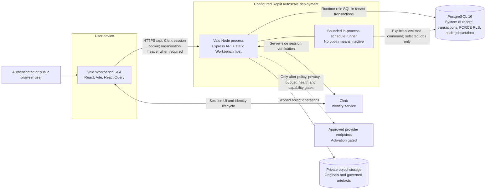

# C4 level 2 — current containers

**Current:** The browser Workbench, same-process Node API/static host, PostgreSQL, private object storage adapter, Clerk integration, and optional in-process schedules are present in source.

**Target:** A separately authenticated durable worker and independent audit witness remain target containers; neither should be inferred from the current API deployment.

**Deployed:** `.replit` configures one Autoscale Node deployment. The repository does not itself prove a currently running instance, replica count, region, or provider state.

**Verified:** CI builds and tests the Workbench, API, contracts, and PostgreSQL controls. Live topology and external-provider operation require deployment evidence.

Last reviewed: **2026-08-31**

## Current container diagram

The built SPA is served by the Node process in production and executes in the browser. It is not a separately deployed CDN container in the current Replit configuration. Development may run API and Workbench processes separately through the Replit workflows; that is a development topology, not production evidence.

## Container catalogue

| Container                  | Technology and responsibility                                                                                           | Current                                                                                                                                                                                | Target                                                                                                                                     | Deployed / Verified                                                                                                                                          |
| -------------------------- | ----------------------------------------------------------------------------------------------------------------------- | -------------------------------------------------------------------------------------------------------------------------------------------------------------------------------------- | ------------------------------------------------------------------------------------------------------------------------------------------ | ------------------------------------------------------------------------------------------------------------------------------------------------------------ |
| Workbench SPA              | React/Vite interface; public pages, session/organisation UX, permission-aware workspaces, generated API client.         | Implemented under [`artifacts/valo-workbench`](../../artifacts/valo-workbench/).                                                                                                       | Remains non-authoritative; future clients must use the same contracts and authority rules.                                                 | Production build is part of CI/release candidate. Live browser behavior needs deployed smoke/accessibility evidence.                                         |
| Node API and static host   | Express API, middleware pipeline, deterministic commands/queries, adapter coordination, and production static serving.  | [`app.ts`](../../artifacts/api-server/src/app.ts) mounts health/public/authenticated surfaces; [`webApp.ts`](../../artifacts/api-server/src/lib/webApp.ts) serves the Workbench build. | Stay a modular monolith unless a new ADR proves a split is warranted.                                                                      | `.replit` configures Autoscale startup; immutable provider deployment verification is external.                                                              |
| PostgreSQL                 | Authoritative relational state, tenant context/RLS, optimistic versions, audit chain, operational ledgers, jobs/outbox. | Schema and migrations are source controlled under [`lib/db`](../../lib/db/).                                                                                                           | Managed HA and independently rehearsed recovery remain operational objectives.                                                             | CI uses PostgreSQL 16. Startup attestation is implemented; live database identity and topology require retained evidence.                                    |
| Private object storage     | Uploaded originals and generated artefacts addressed through governed metadata.                                         | Adapter and lifecycle controls exist in API source.                                                                                                                                    | Provider reconciliation, inspection, terminal deletion evidence, and backup coverage must satisfy activation manifests.                    | Provider configuration may exist in a deployment; this repository is not provider-health evidence.                                                           |
| In-process schedule runner | Opt-in, allowlisted, non-overlapping execution for manifest jobs whose activation is `ready_for_platform_install`.      | Implemented by [`run-inprocess-schedules.mjs`](../../scripts/run-inprocess-schedules.mjs); absent opt-in means no schedules.                                                           | Prefer a platform scheduler/dedicated workload identity where required.                                                                    | Schedule manifest currently distinguishes ready, blocked, and not-installed states. A configured environment value alone is not a retained platform receipt. |
| Durable worker             | Lease/fence/retry/dead-letter/outbox execution with workload identity.                                                  | Foundation code and tests exist; human-session control route and provider effects are intentionally inactive.                                                                          | Separate process/container with authenticated workload identity, handler allowlist, fairness, metrics, reconciliation, and shutdown proof. | Not a current deployed container based on repository evidence.                                                                                               |
| Independent audit witness  | Immutable external checkpoint receipt.                                                                                  | Validator/control intent exists; provider is disconnected.                                                                                                                             | Approved WORM/independent witness and reconciliation.                                                                                      | Not deployed or verified by repository evidence.                                                                                                             |

## Container rules

- The Workbench may present permissions and preflights, but the API and database re-evaluate authority and invariants.
- The API must not turn provider or storage availability into an authority decision.
- PostgreSQL tenant context is set only after authenticated access resolution and remains transaction local.
- Background work carries immutable tenant/capability scope and idempotency; a human browser session is not a worker identity.
- A target container is not drawn as current simply because its schema, interface, or test foundation exists.

The selected internal components are expanded in [COMPONENTS.md](COMPONENTS.md). Runtime placement is expanded in [DEPLOYMENT.md](DEPLOYMENT.md).
