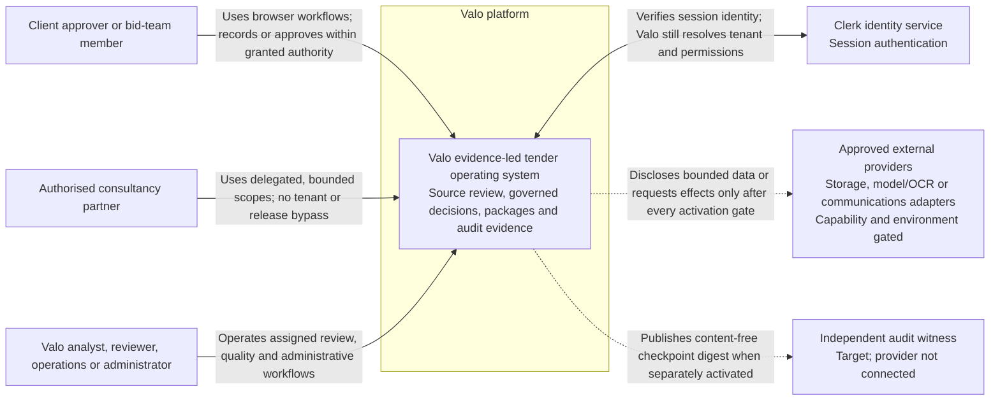

# C4 level 1 — system context

**Current:** The people, Valo boundary, Clerk relationship, and activation-gated provider relationship are present in source contracts.

**Target:** Additional approved provider capabilities and an independent audit witness may extend the context without moving human approval authority outside Valo.

**Deployed:** Replit is configured as the hosting platform; live integrations require an external deployment record and are not established by this diagram.

**Verified:** Source and contract tests cover identity, tenant, permission, provider, and human-authority rules. This view is not live connectivity evidence.

Last reviewed: **2026-08-31**

## Context diagram

The platform is one software system at this level. PostgreSQL, the browser SPA, the Node API, and object storage are internal containers and appear in [CONTAINERS.md](CONTAINERS.md). GitHub Actions and Replit promotion are delivery infrastructure and appear in [DEPLOYMENT.md](DEPLOYMENT.md).

## People and authority

| Person                             | Primary goals                                                                    | Authority boundary                                                                                                                                                                                          |
| ---------------------------------- | -------------------------------------------------------------------------------- | ----------------------------------------------------------------------------------------------------------------------------------------------------------------------------------------------------------- |
| Client approver or bid-team member | Supply evidence, review gaps, respond to actions, approve within assigned scope. | A browser claim never establishes tenant, identity, readiness, price, or approval. Direct membership and current grants remain server decisions.                                                            |
| Consultancy partner                | Work in explicitly delegated client/project scope.                               | Partner-derived access is capped by the relationship and route policy. Sensitive direct-membership workspaces and release authority remain unavailable unless separately granted through an allowed source. |
| Valo analyst/reviewer              | Extract, reconcile, review, test, sign, and assemble governed outputs.           | AI suggestions and deterministic preflights do not substitute for the named human required by the workflow. Maker-checker and current-grant rules apply.                                                    |
| Valo operations/administrator      | Manage configuration, evidence, incidents, and bounded control-plane workflows.  | No global platform role bypasses tenant RLS. Owner-only migration or maintenance identities are not interactive application roles.                                                                          |

Role and access details are governed by the [permissions matrix](../implementation-v2.5/PERMISSIONS_MATRIX.md), current middleware under [`artifacts/api-server/src/middlewares`](../../artifacts/api-server/src/middlewares/), and the Workbench [role/route matrix](../ui-overhaul/ROLE_ROUTE_MATRIX.md).

## External-system relationships

| External system               | Current relationship                                                                                                            | Data/authority rule                                                                                                                                                                        | Evidence                                                                                                                                                                                                         |
| ----------------------------- | ------------------------------------------------------------------------------------------------------------------------------- | ------------------------------------------------------------------------------------------------------------------------------------------------------------------------------------------ | ---------------------------------------------------------------------------------------------------------------------------------------------------------------------------------------------------------------- |
| Clerk                         | Authenticates the browser session used by the API.                                                                              | Clerk proves session identity; Valo maps it to a local active user, selected organisation, access source, roles, and permissions.                                                          | [`app.ts`](../../artifacts/api-server/src/app.ts), [`auth.ts`](../../artifacts/api-server/src/middlewares/auth.ts), [Clerk proxy middleware](../../artifacts/api-server/src/middlewares/clerkProxyMiddleware.ts) |
| Managed object storage        | Stores private uploaded/generated bytes behind Valo metadata and scoped access.                                                 | Object paths are not authorisation. Tenant/database records, hashes, state, and signed access mediate every governed use.                                                                  | [object-storage service](../../artifacts/api-server/src/lib/objectStorage.ts), [storage lifecycle](../../artifacts/api-server/src/lib/storageLifecycle/)                                                         |
| Model/OCR and other providers | Available only through typed adapters and capability-specific gates; several production effects remain disabled or unconnected. | Providers receive no database, object-store, shell, or arbitrary-network credentials. Missing governance, region, retention, budget, health, or release evidence denies disclosure/effect. | [provider contracts](../../artifacts/api-server/src/lib/providerContracts.ts), [AI architecture](../ai-overhaul/TARGET_ARCHITECTURE.md), [provider ADR](../implementation-v2.5/adrs/0005-provider-adapters.md)   |
| Independent audit witness     | Target relationship for immutable checkpoint receipts.                                                                          | Digests only; no tender content. A local hash chain alone is not external anchoring.                                                                                                       | [audit anchoring ADR](../implementation-v2.5/adrs/0004-audit-anchoring.md), [schedule manifest](../../config/operations/schedules.v1.json)                                                                       |

## Valo responsibilities

Valo is responsible for authenticated tenant selection, permission and object checks, evidence/version integrity, deterministic gates, suggestion containment, named-human decisions, package provenance, audit evidence, privacy-safe operations, and truthful failure states.

Valo does **not** guarantee an award or evaluator acceptance, invent evidence or credentials, autonomously approve/sign/submit a bid, infer a tenant from client input, or claim an external action happened without a reconciled receipt. Product boundaries are detailed in the [user manual](../USER_MANUAL.md) and [product requirements](../implementation-v2.5/PRODUCT_REQUIREMENTS.md).

## Trust boundaries

1. The browser and every request body are untrusted.
2. An authenticated identity is not yet a tenant permission decision.
3. Application authorisation precedes transaction-local database tenant context; RLS is defence in depth, not authentication.
4. Object storage and providers are outside the application/database trust boundary.
5. Generated suggestions, uploaded text, OCR, and provider output remain untrusted data until deterministic validation and human review.
6. Build, deployment, and runtime identity are separate authorities; a source commit alone is not a deployed release.

See [dynamic flows](DYNAMIC_FLOWS.md) for the request and release sequences.
