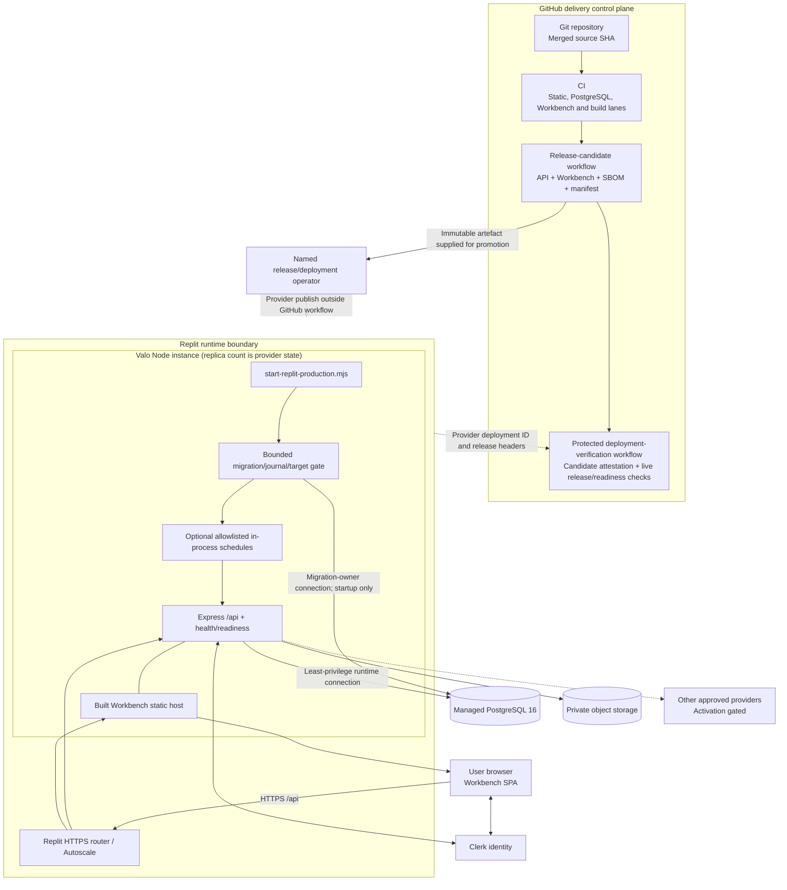

# Current Replit deployment and trust boundaries

**Current:** Source defines a Replit Autoscale build/run configuration, a same-process startup gate, a production API/static host, and GitHub release/deployment verification workflows.

**Target:** Dedicated workers/schedulers, independently evidenced backup/restore and audit anchoring, and any additional infrastructure require separate activation and records.

**Deployed:** The checked-in files prove configuration only. This guide does not assert that a particular commit is live; that requires the external candidate run, release digest, provider deployment ID, URL, and verification record.

**Verified:** CI and release tooling are testable in source. Only the protected deployment-verification workflow can bind those artefacts to a named live deployment.

Last reviewed: **2026-08-31**

## Configured topology

The release-candidate workflow does not deploy. A named operator promotes through the provider. The verification workflow then downloads the exact candidate, attests its GitHub run, probes the selected environment, and records the provider deployment identity. See [release provenance](../implementation-v2.5/RELEASE_PROVENANCE.md).

## Runtime placement

| Element                  | Current source/configuration                                                                                                      | Deployment qualification                                                                                                         |
| ------------------------ | --------------------------------------------------------------------------------------------------------------------------------- | -------------------------------------------------------------------------------------------------------------------------------- |
| Hosting target           | [`.replit`](../../.replit) selects `deploymentTarget = "autoscale"`.                                                              | Region, live replica count, routing policy, and deployment ID are provider state and must come from deployment evidence.         |
| Build                    | Root build typechecks and builds the API and Workbench; the release workflow also produces a manifest and SBOM.                   | A successful build is not a promoted or verified release.                                                                        |
| Start                    | [startup wrapper](../../scripts/start-replit-production.mjs) gates migration selection, optional schedules, then imports the API. | A live start must expose matching release/readiness identity; source alone cannot show it ran.                                   |
| Web delivery             | In production, [`webApp.ts`](../../artifacts/api-server/src/lib/webApp.ts) serves the built Workbench from the Express process.   | The current topology is not a separately deployed CDN web tier, although provider edge caching/routing may exist outside source. |
| API                      | [`app.ts`](../../artifacts/api-server/src/app.ts) serves health/public/protected APIs and static assets in the same Node process. | Autoscale lifecycle and connection behavior require production observation.                                                      |
| Database                 | PostgreSQL 16 is selected; migrations and runtime security are source controlled under [`lib/db`](../../lib/db/).                 | Exact host, HA/backup posture, role identity, journal and attestation results are deployment evidence, not documentation facts.  |
| Object storage/providers | Adapters exist and configuration is environment supplied.                                                                         | Provider health, region, retention, DPA, backup and deletion reconciliation require their own evidence.                          |
| Background schedules     | No `VALO_INPROCESS_SCHEDULES` opt-in means none start. Only manifest jobs marked ready and using supported cron shapes may run.   | The schedule manifest states platform installation is not evidenced; logs/receipts and liveness signals are required.            |

## Startup and credential boundary

The production launcher performs a fail-closed sequence:

1. validate the owner/runtime database target relationship and accepted migration lineage;
2. serialize and apply only the bounded missing migration suffix allowed by the launcher;
3. prove the exact migration journal/catalog and runtime least-privilege boundary;
4. capture only the runtime credential needed by an explicitly selected delayed schedule while avoiding retention of the migration-owner password;
5. optionally start only allowlisted, activation-ready in-process schedules;
6. import the API, which uses the least-privilege runtime pool and removes database URLs from the mutable process environment;
7. listen only after readiness-critical startup checks pass.

`DATABASE_URL` is a migration-owner startup authority, not an application credential. `VALO_RUNTIME_DATABASE_URL` is the constrained application connection. Environment erasure limits accidental later reuse; it is not isolation from arbitrary code execution in the same process. The exact contract is documented in [`replit.md`](../../replit.md) and enforced by [`runtimeSecurity.ts`](../../lib/db/src/runtimeSecurity.ts).

## Trust boundaries

| Boundary                               | Crossing control                                                                                        | Failure posture                                                                                        |
| -------------------------------------- | ------------------------------------------------------------------------------------------------------- | ------------------------------------------------------------------------------------------------------ |
| Internet → Replit runtime              | HTTPS router, CORS, security headers, bounded rate limiting, body limits.                               | Reject disallowed origin/abuse/malformed input without exposing internal detail.                       |
| Browser → authenticated API            | Clerk session verification, local-user status, explicit organisation/access context and permissions.    | 401/403/access-required; no client authority fallback.                                                 |
| API → PostgreSQL                       | Separate runtime identity, transaction-local organisation, FORCE RLS, trigger/function/ACL attestation. | Startup/readiness or request fails closed on missing/drifted context/control.                          |
| API → object storage                   | Governed metadata, tenant/resource checks, hashes, scoped adapter/service credentials.                  | No path-based authority; unavailable mandatory artefact blocks the operation before success streaming. |
| API → external provider                | Capability/tenant/environment flag, privacy/region/retention/budget/health/release gates.               | Specific safe denial; deterministic/manual path remains.                                               |
| GitHub candidate → provider deployment | Exact merged source, immutable manifest/SBOM/digests, named promotion, provider deployment ID.          | Candidate does not self-authorise deployment. Mismatch blocks verification.                            |
| Provider deployment → verification     | Protected environment URL/secret, release headers, liveness/readiness, immutable deployment ID.         | No “deployed” claim without a matching record.                                                         |

## Required deployment evidence

A complete deployed/verified claim names all of the following without committing secrets or client data:

- merged source SHA and candidate workflow run ID;
- release manifest SHA-256, API/Workbench artefact digests, and SBOM;
- immutable provider deployment ID, environment, and canonical URL;
- migration journal/version and runtime identity/attestation result;
- liveness, authenticated readiness, and release-identity result;
- redacted configuration/flag/rule-pack digest;
- backup/restore/rollback and post-deploy smoke evidence appropriate to the release;
- observation window, deviations, and named approvals.

The durable record belongs in protected CI/provider evidence. The repository [deployment record](../implementation-v2.5/DEPLOYMENT_RECORD.md) is a template/index, not a place for secrets or raw production evidence.

## Target deltas

- A separately authenticated worker process remains target until the activation manifest is approved and its control route is safely composed.
- Platform schedules and their identities/receipts should replace or justify in-process scheduling for work that must survive replica churn.
- An independent immutable audit witness and verified backup/restore provider remain open.
- `.replit` is the only checked-in infrastructure declaration; broader infrastructure-as-code, region, network, capacity and recovery topology are not source-defined.
