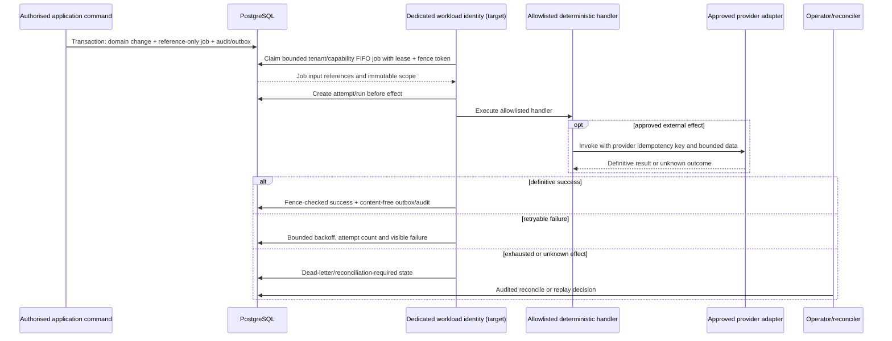
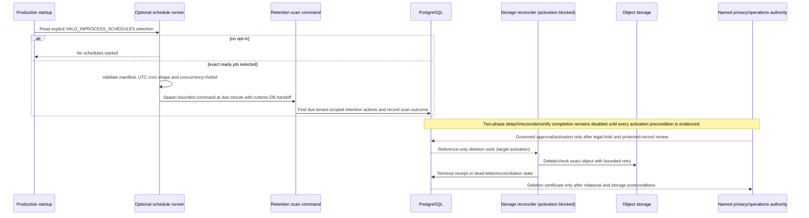

# Dynamic architecture flows

**Current:** Authentication/tenant/RLS, report sign-off, exact package export, startup, and release controls are current source flows. Retention scanning is implemented but opt-in; retention completion remains disabled.

**Target:** The durable worker/outbox sequence is a bounded target activation flow; external effects remain disabled until workload identity and operational controls pass.

**Deployed:** None of these diagrams asserts a live run. Deployment-specific steps require the external evidence described in [DEPLOYMENT.md](DEPLOYMENT.md).

**Verified:** Named source/static/integration tests exercise many transitions and races. A diagram is not a substitute for the relevant database or deployed test.

Last reviewed: **2026-08-31**

## Authentication → tenant → RLS

```mermaid
sequenceDiagram
  actor U as Browser user
  participant E as Express edge
  participant C as Clerk middleware
  participant A as attachUser / access policy
  participant T as Tenant middleware
  participant D as Tenant DB transaction
  participant R as Domain route
  participant P as PostgreSQL + FORCE RLS

  U->>E: HTTPS request + session cookie + optional organisation header
  E->>E: Correlation, logs, security/CORS, bounded rate limits
  E->>C: Verify session
  C-->>A: Authenticated Clerk subject
  A->>P: Resolve active local user
  alt tenant-free control-plane route
    A->>R: /me, organisation discovery, relationship/break-glass/flag lifecycle
  else tenant-owned route
    A->>T: Resolve one direct, partner-derived, or break-glass access context
    T->>T: Derive current roles and permission ceiling; audit break-glass use
    T->>D: Open request-scoped transaction
    D->>P: SET LOCAL current organisation and runtime controls
    D->>R: Enforce resource/released-state boundary
    R->>P: Explicit tenant predicates + RLS-backed query/mutation
    P-->>R: Same-tenant result or denial
    R-->>D: Response outcome
    D->>P: Commit on successful response; rollback on failure/abort
  end
  R-->>U: Bounded response + request ID
```

Key invariants:

- Clerk identity alone grants no tenant access.
- Client headers select among server-known contexts; they do not create a membership.
- Partner/break-glass sources retain separate ceilings and route denials.
- RLS is a database backstop after application authentication/authorisation.
- Tenant transaction settlement is part of the response lifecycle; slow/provider work should move behind durable boundaries rather than hold it indefinitely.

Evidence: [`app.ts`](../../artifacts/api-server/src/app.ts), [`routes/index.ts`](../../artifacts/api-server/src/routes/index.ts), [`tenancy.ts`](../../artifacts/api-server/src/middlewares/tenancy.ts), [`databaseTenancy.ts`](../../artifacts/api-server/src/middlewares/databaseTenancy.ts), and [ADR-0002](../implementation-v2.5/adrs/0002-tenancy-and-rls.md).

## Report sign-off and concurrent revocation

```mermaid
sequenceDiagram
  actor Reviewer
  participant API as Sign-off route
  participant DB as PostgreSQL transaction
  participant Admin as Membership/grant administration

  Reviewer->>API: POST report sign-off + attestation
  API->>DB: Begin tenant request transaction; resource boundary locks project
  API->>DB: Read tenant/report/project and preliminary readiness
  API->>DB: Enter final savepoint; acquire organisation membership-administration advisory lock
  DB->>DB: Re-read active user, membership, grant, report, project, client NDA and release inputs
  DB->>DB: Evaluate authority at database clock and recompute readiness
  alt authority or source changed
    DB-->>API: Roll back with authority/release conflict
    API-->>Reviewer: 403/409; refresh and review
  else exact authority and inputs remain valid
    DB->>DB: Sign report and transition project with compare-and-swap + audit
    DB-->>API: Commit
    API-->>Reviewer: Signed-off report
  end
  Admin->>DB: Revoke membership/grant
  Note over Admin,DB: Same advisory-lock family serialises revocation and sign-off; whichever commits first is observed by the other.
```

The signer is server-derived. The final transaction does not trust a previously loaded role or browser name. The shared resource boundary establishes the project-first lock order before the route; membership administration never takes a project lock, so revocation has no lock-order back-edge. Tests include both “revocation commits first” and “sign-off holds authority first” orderings in [`reports.export.integration.test.ts`](../../artifacts/api-server/src/routes/reports.export.integration.test.ts).

## Exact package export and NDA revocation

```mermaid
sequenceDiagram
  actor Operator
  participant API as Reports/package API
  participant Store as Private object storage
  participant DB as PostgreSQL

  Operator->>API: GET reports + canonical package-version projection
  API-->>Operator: Latest report, exact package binding, exportScopeSha256
  Operator->>API: POST project export + UUID Idempotency-Key + quoted If-Match + exact body
  API->>DB: Begin tenant request transaction; resource boundary locks project
  API->>DB: Permission/readiness/source reads in tenant scope
  API->>Store: Fetch mandatory signed report before success headers
  API->>API: Build canonical entries, manifest and ZIP in memory
  API->>DB: Enter final savepoint; lock selected membership authority
  DB->>DB: For partner context, share-lock exact relationship; evaluate access at DB clock
  API->>DB: Re-enter project lock; lock package/idempotency scope
  DB->>DB: Re-read project, latest signed report, package binding and current client NDA/version
  DB->>DB: Re-evaluate the same access source at a fresh DB clock
  alt scope, source, authority or NDA changed
    DB-->>API: Roll back; no package/export receipt
    API-->>Operator: 409/403 safe denial; refresh
  else matching prior idempotency receipt
    DB->>DB: Verify rebuilt manifest still matches receipt; write nothing
    DB-->>API: Read-only replay accepted
  else new exact request
    DB->>DB: Persist/reuse canonical package version + idempotency receipt + audit + exported transition
    DB-->>API: Commit
  end
  API-->>Operator: Send buffered ZIP only after mandatory artefact and durable decision succeed
```

The request boundary establishes the global project-first order before export does object I/O; this intentionally holds the project lock across bounded in-memory assembly and is monitored as `AR-010`. Membership/grant updates use the same organisation advisory lock as export authority but take no project lock; partner lifecycle updates contend on the exact relationship row and likewise take no project lock. An authority or NDA revocation that commits first therefore denies export, while a revocation that waits observes the committed operation boundary. Authority is evaluated again at a fresh database clock after package/client waits so natural expiry also fails closed. The partner-edition feature flag is re-read but is not covered by this serialization claim. The exact request prevents a UI approval of one report/package projection from silently authorising another. Evidence: [`reports.ts`](../../artifacts/api-server/src/routes/reports.ts), [`directMembershipAuthority.ts`](../../artifacts/api-server/src/lib/directMembershipAuthority.ts), [`projectExportPackage.ts`](../../artifacts/api-server/src/lib/projectExportPackage.ts), and the live PostgreSQL integration test above.

## Durable worker and outbox target flow

**Current/Target qualification:** admission, leasing, fencing, retries, dead-letter and outbox primitives exist. The worker control route is intentionally unmounted and external effects are disabled. The sequence below describes the approved activation shape, not a running worker.



Activation requires a non-interactive workload identity, handler allowlist, fairness, privacy-safe telemetry, provider/budget governance, crash/fence/duplicate/two-tenant tests, and graceful shutdown evidence. See [durable worker implementation](../durable-worker-foundation/IMPLEMENTATION.md), [worker activation manifest](../../config/operations/worker-activation.v1.json), and [ADR-0003](../implementation-v2.5/adrs/0003-durable-jobs.md).

## Retention scan and deletion completion



The source manifest currently marks the retention scan and authenticated limiter purge as ready for platform installation, while storage deletion reconciliation and retention completion remain blocked/open. Do not collapse “scan implemented,” “schedule installed,” and “deletion completed.” Sources: [schedule runner](../../scripts/run-inprocess-schedules.mjs), [schedule manifest](../../config/operations/schedules.v1.json), [retention activation](../../config/operations/retention-completion-activation.v1.json), and [retention implementation](../privacy-operations/INTEGRATION.md).

## Startup and bounded migration

```mermaid
sequenceDiagram
  participant R as Replit instance
  participant L as Startup launcher
  participant O as Migration-owner connection
  participant DB as PostgreSQL
  participant S as Optional schedules
  participant A as API/runtime pool

  R->>L: Start production process with owner + runtime configuration
  L->>O: Validate same target and separated identities
  O->>DB: Acquire startup advisory lock; inspect exact journal/catalog
  alt accepted journal prefix with missing bounded suffix
    O->>DB: Apply only pinned missing migrations
  else current exact journal
    O->>DB: No migration mutation
  else drift or unsafe lineage
    O-->>L: Fail startup before listen
  end
  O->>DB: Prove journal, RLS, policies, triggers, routines and runtime ACLs
  L->>S: Start only explicit activation-ready schedules (optional)
  L->>A: Import built API
  A->>DB: Connect as least-privilege runtime; attest runtime identity
  A->>A: Remove database URLs from mutable environment
  A-->>R: Listen; readiness reports exact lifecycle/release state
```

The launcher accepts only explicitly reviewed migration lineages and suffixes; it is not a general `push` or unrestricted migration step. Sources: [`start-replit-production.mjs`](../../scripts/start-replit-production.mjs), [`replit-intake-migrations.mjs`](../../lib/db/scripts/replit-intake-migrations.mjs), [`runtimeSecurity.ts`](../../lib/db/src/runtimeSecurity.ts), and the [deployment runbook](../implementation-v2.5/runbooks/DEPLOYMENT.md).

## Release candidate → promotion → deployment verification

```mermaid
sequenceDiagram
  actor Owner as Named release/deployment operator
  participant Main as Merged main SHA
  participant RC as Release-candidate workflow
  participant Artifact as Immutable candidate artefact
  participant Host as Replit deployment
  participant DV as Protected deployment-verification workflow

  Owner->>RC: Dispatch full SHA already merged into main
  RC->>Main: Prove exact checkout and ancestry
  RC->>RC: Governance, release config, usability gate, DB proof and builds
  RC->>Artifact: Upload API, Workbench, SBOM and release manifest
  RC-->>Owner: Candidate run ID + release SHA-256
  Owner->>Host: Promote exact candidate through provider control plane
  Host-->>Owner: Immutable provider deployment ID
  Owner->>DV: Candidate run + source SHA + deployment ID + environment
  DV->>Artifact: Attest workflow and reverify exact manifest
  DV->>Host: Probe liveness, authorised readiness and release identity
  alt exact match
    DV-->>Owner: Retained deployment-verification record
  else mismatch or unhealthy
    DV-->>Owner: Verification failure; no verified-deployment claim
  end
```

The GitHub release workflow deliberately does not publish to Replit and the provider publish does not prove candidate identity on its own. Sources: [release-candidate workflow](../../.github/workflows/release-candidate.yml), [deployment-verification workflow](../../.github/workflows/deployment-verification.yml), and [release provenance guide](../implementation-v2.5/RELEASE_PROVENANCE.md).
