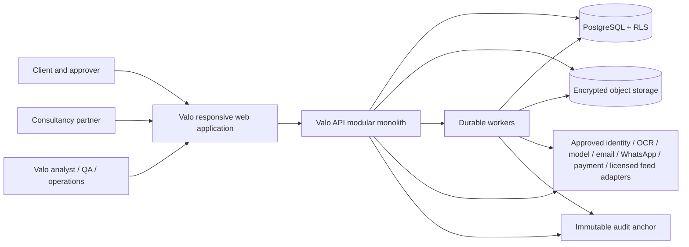

# Technical architecture (updated TRD)

Status: target architecture. Observed implementation is recorded in `BASELINE_AUDIT.md`; verification is recorded in `REQUIREMENTS_TRACEABILITY.md`.

## Decision summary

Valo remains a TypeScript modular monolith with isolated durable workers, PostgreSQL, encrypted object storage, and provider adapters. The observed React/Express/Drizzle/OpenAPI stack is preserved. Module boundaries are strengthened in-place; microservices are not justified through v2.5.

## System context



## Deployable units

| Unit           | Responsibility                                                                                                       | Scaling boundary                                |
| -------------- | -------------------------------------------------------------------------------------------------------------------- | ----------------------------------------------- |
| Web            | Role-specific responsive UX; never authoritative for permissions/gates                                               | Stateless CDN/web replicas                      |
| API            | Authentication, tenant context, authorisation, deterministic commands/queries, upload coordination, signed downloads | Stateless API replicas                          |
| Worker         | Intake scanning, parsing/OCR, extraction, notifications, assembly, rendering, retention, anchoring, reconciliation   | Queue-class concurrency and per-tenant fairness |
| PostgreSQL     | System of record, RLS backstop, outbox/jobs, idempotency, versioning, audit metadata                                 | Managed HA database                             |
| Object storage | Immutable originals, derived artefacts, packages, anchors, backup artefacts                                          | Provider durability/region                      |

Workers may share the repository and domain packages while running as separate processes. Moving a module to a service requires an ADR with measured pressure, failure isolation need, and operational ownership.

## Module boundaries

| Module                | Owns                                                                    | May depend on                            |
| --------------------- | ----------------------------------------------------------------------- | ---------------------------------------- |
| Identity & tenancy    | organisations, memberships, grants, partner relationships, break-glass  | audit, outbox                            |
| Engagements           | engagements, tenders, lots, assignments, conflicts, SLA                 | tenancy, entitlement, audit              |
| Entitlements          | price books, products, orders, subscriptions, invoices, payments, usage | tenancy, adapters, audit                 |
| Intake                | files, versions, upload sessions, quarantine, classification            | engagement, storage adapter, jobs, audit |
| Document intelligence | OCR/extraction/model/prompt/evaluation runs, citations                  | intake, AI adapters, jobs, audit         |
| Compliance            | requirements, defects, remediation, states, approvals                   | engagement, evidence, audit              |
| Evidence              | vault artefacts, capability claims/evidence/usage                       | tenancy, intake, audit                   |
| BOQ                   | workbooks, rows, rules, exceptions                                      | intake, rule packs, audit                |
| Draft & review        | drafts, revisions, comments, provenance, approvals                      | compliance, evidence, audit              |
| Package               | manifests, render jobs, visual QA, sign-off, exports                    | draft, BOQ, compliance, storage, audit   |
| Partner & branding    | partner workspace, brand profile, QA responsibility                     | tenancy, entitlement, package            |
| Analytics             | operational projections and privacy-safe benchmark releases             | consent, audit; no source ownership      |
| Platform operations   | flags, providers, notifications, incidents, retention, anchors          | all through stable commands/events       |

Cross-module writes go through application commands. Database foreign keys may enforce integrity, but route handlers must not assemble domain policy ad hoc.

## Command and event model

Commands are synchronous when a user needs an authoritative decision: assign role, confirm requirement, approve evidence, transition state, sign package. Expensive or provider-dependent work is a job. Each accepted command commits domain mutation, audit event, and outbox event in one transaction.

Representative events:

- `engagement.created.v1`, `conflict.detected.v1`, `entitlement.validated.v1`
- `file.uploaded.v1`, `file.quarantined.v1`, `file.cleared.v1`, `document.versioned.v1`
- `extraction.completed.v1`, `requirement.confirmed.v1`, `requirement.reopened.v1`
- `evidence.approved.v1`, `evidence.expiring.v1`, `defect.reclassified.v1`
- `package.validated.v1`, `package.signed.v1`, `export.delivered.v1`
- `consent.withdrawn.v1`, `retention.completed.v1`, `audit.anchor.published.v1`

Events carry `event_id`, `type`, `schema_version`, `occurred_at_utc`, `tenant_id`, `aggregate_type/id/version`, `actor_id`, `correlation_id`, `causation_id`, and a minimal non-sensitive payload. Consumers are idempotent by `event_id`.

## Critical intake/extraction sequence

```mermaid
sequenceDiagram
  participant U as User
  participant A as API
  participant D as PostgreSQL
  participant S as Object storage
  participant W as Worker
  participant P as Scanner/OCR/model adapters

  U->>A: Request upload session
  A->>D: Authorise tenant, engagement, NDA, conflict, entitlement
  A-->>U: Scoped resumable upload + limits
  U->>S: Upload bytes
  U->>A: Complete upload(hash, idempotency key)
  A->>D: Transaction: file version=quarantined + job + audit/outbox
  W->>S: Stream immutable original
  W->>P: Malware/signature/archive checks
  alt unsafe/ambiguous
    W->>D: Quarantine reason + operator task + audit
  else cleared
    W->>D: Mark cleared; enqueue parse/OCR
    W->>P: Parse/OCR with timeout
    W->>D: Persist page/coordinate text + provenance
    W->>P: Schema-constrained extraction
    W->>D: Validate citations; store suggestions only
  end
  A-->>U: Progress/recovery status
```

## Readiness/sign-off transaction

The sign command locks or version-checks the package aggregate, recomputes all gates inside one database transaction, and refuses stale versions. It checks: tenant, role/assignment, entitlement, source versions, confirmed citations, valid evidence, grounded claims, unresolved placeholders, fatal/likely-fatal defects, BOQ exceptions, red-team result, client/Valo approvals, render success, human visual QA, manifest hashes and feature flags. Success creates an immutable signed package version and audit/outbox entry. No cached client readiness score is authoritative.

## Tenancy and authorisation

The authenticated identity resolves to server-side memberships/grants. Middleware establishes a validated tenant context; PostgreSQL `SET LOCAL app.tenant_id` (or equivalent parameter consumed by policies) applies per transaction. Tenant-owned tables include immutable `tenant_id`; RLS uses both tenant and relationship/assignment where necessary. Workers establish the same tenant context from authenticated job metadata. See ADR-0002.

Storage keys begin with a non-guessable immutable tenant identifier, but path naming is not the control: all access goes through scoped service credentials/policies and signed downloads. Search indexes, caches, vector retrieval and model context carry the same tenant partition.

## Durable jobs

Jobs are persisted with unique idempotency scope, attempt count, `available_at`, lease owner/expiry, heartbeat, progress, cancellation state, input version and result reference. Workers claim with `FOR UPDATE SKIP LOCKED` or an approved managed queue adapter, use bounded exponential backoff with jitter, and move exhausted jobs to a dead-letter state requiring audited replay. A provider timeout leaves deterministic state unchanged except the visible failure/retry record.

Job classes: malware, archive expansion, parse/OCR, extraction, citation validation, evaluation, notification, provider reconciliation, package assembly, rendering, audit anchoring, retention/deletion, backup verification and export delivery. Queue concurrency is bounded by provider and tenant to prevent one deadline from starving others.

## Concurrency and idempotency

- Mutable aggregates expose integer `version`; updates require `If-Match`/expected version.
- Repeated external commands require an idempotency key scoped to tenant + operation + actor/client.
- Provider webhook identifiers are unique and raw payload digests retained without sensitive log bodies.
- Duplicate job delivery is expected; side effects use write-ahead state and provider idempotency keys.
- Package and report inputs are content-addressed; a changed source invalidates downstream artefacts.
- Tender addenda never overwrite source versions and trigger deterministic impact analysis.

## Provider adapters

Each adapter exposes typed capabilities and normalised errors: `IdentityProvider`, `ObjectStore`, `MalwareScanner`, `DocumentParser`, `OcrProvider`, `ModelProvider`, `EmailProvider`, `WhatsAppProvider`, `PaymentProvider`, `TenderFeedProvider`, `AuditAnchor`. Configuration records residency, retention/training terms, timeout, retry safety and health status. Development adapters refuse to initialise in staging/production.

## Feature flags

Flags are evaluated on the server using environment, release, tenant, role and capability. Default is off for partner management, client self-service mutations, low-risk auto-confirm, benchmark publication, WhatsApp intake, payment charging and any restricted-mode claim. A flag cannot bypass permission, entitlement, evidence, conflict, privacy or readiness gates.

## API contract

OpenAPI remains the external contract. All mutations use consistent error envelopes, correlation IDs, idempotency and version preconditions. Generated clients must be regenerated and drift-tested in CI. No endpoint may accept tenant identity, actor identity, approval identity, price, or readiness state as authoritative client-provided fields.

## Time, money and jurisdiction

Persist instants in UTC. Business deadlines carry IANA zone `Africa/Lagos`, local date/time and calendar version; calculations are replayable after calendar changes. Money is `{amount decimal/numeric, currency ISO 4217}`; never IEEE float or JavaScript `number` for stored monetary arithmetic. Tax/bid-security/rounding logic resolves a signed Nigeria/tender rule-pack version effective for the transaction date.

## Observability and data minimisation

Structured logs include correlation, tenant pseudonym, route/job, result code and duration; never documents, extracted text, secrets, credentials, evidence excerpts or unnecessary personal data. Metrics and traces use bounded labels. Security events and tenant-denial patterns alert independently. Health proves process liveness; readiness proves required dependencies and migration compatibility.

## Environment and release design

Development, test, staging and production use separate identity, database, storage, keys and provider credentials. Build once; promote the same signed artefact with SBOM and provenance. Migrations are forward-compatible: expand, deploy dual-read/write if required, backfill idempotently, verify, contract in a later release. Rollback never assumes a destructive down migration.

## Known target-versus-baseline gaps

The observed application does not prove PostgreSQL RLS, full organisations/memberships, durable jobs, partner/billing modules, real migrations, immutable anchoring, complete adapters, IaC, production monitoring or the specified release transaction. They remain planned until the traceability evidence says otherwise.
