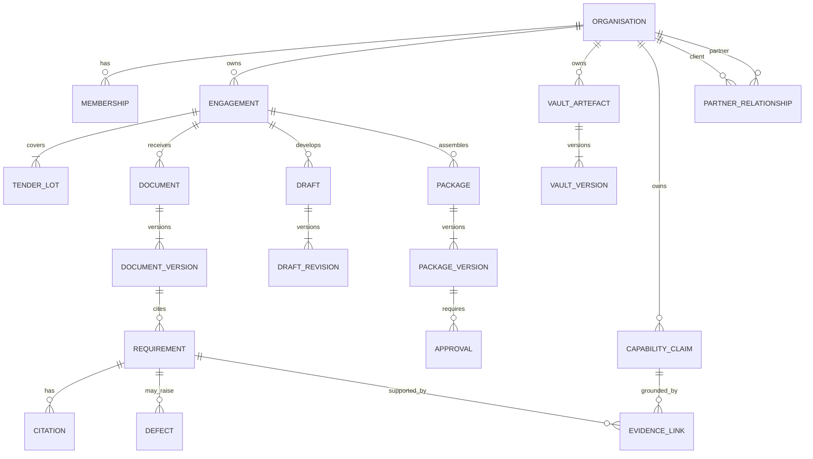

# Data model

This is the v2.5 logical model and migration contract. Names may be mapped to existing tables incrementally, but semantics and constraints are normative.

## Global conventions

- Tenant-owned tables contain immutable `tenant_id uuid not null` and are protected by enabled/forced PostgreSQL RLS.
- Primary keys are UUID/ULID generated server-side; public identifiers are non-sequential.
- Mutable aggregates carry `version bigint not null default 1`; compare-and-swap updates increment it.
- `created_at`, `updated_at` and event times are `timestamptz` in UTC. Business deadlines also store local date/time, `Africa/Lagos`, and calendar version.
- Money uses `numeric(24,6)` (or a documented tighter scale) plus three-letter currency; not `float8` or JS number.
- Closed business states are constrained by database enum/check or referenced versioned state definitions.
- Originals, signed packages, approvals and audit events are immutable; corrections are new versions/events.
- JSON is limited to versioned provider payloads/metadata; query-critical state is relational.

## Ownership model

## Core tables and required constraints

### Identity, tenancy and access

- `users`: external subject identifier unique by identity provider; status; no global business role.
- `organisations`: legal/display name, type `client|partner|valo`, status, region preference, classification.
- `memberships`: `(organisation_id,user_id)` unique, status, start/end, invited/approved identities.
- `roles`, `permissions`, `role_permissions`: versioned platform definitions.
- `role_grants`: tenant, membership, role, optional engagement, purpose, starts/expires, granted/revoked by; no self-grant for privileged roles.
- `partner_relationships`: partner tenant, client tenant, ownership/administration/QA scopes, effective range, contract reference; unique active relationship.
- `break_glass_grants`: ticket, tenant, subject, scope, reason, approver, start/expiry/revocation/after-action; short maximum TTL.
- `nda_records`, `privacy_acknowledgements`, `lawful_basis_records`, `consent_records`: notice/document version, purpose, actor/data subject, capture source, grant/withdraw times.

### Commercial and entitlement

- `price_books`, `price_book_versions`, `products`, `product_versions`: effective dating; minor currency units/decimal, never route constants.
- `orders`, `order_lines`, `subscriptions`, `service_retainers`, `entitlements`, `usage_ledger`, `invoices`, `payments`, `payment_events`.
- Provider event IDs and idempotency keys are unique. Amount/currency constraints reconcile order, invoice and payment; ambiguous payment never grants entitlement.

### Engagement and tender

- `engagements`: tenant, client/partner relationship, product/order, status, SLA, calendar, deadline, reviewer, lock version, cancellation/withdrawal/archive facts.
- `tenders`: issuing entity, authoritative reference, jurisdiction/rule-pack, source provenance.
- `tender_lots`: tender, canonical lot reference; unique within tender.
- `engagement_lots`, `engagement_assignments`, `engagement_notes`, `tasks`, `comments`.
- `conflict_cases`: canonical tender+lot, involved engagements/tenants, detected reason, decision, evidence, independent approver, expiry. Partial unique indexes prevent overlapping active assignments where policy forbids them.

### Files and document intelligence

- `upload_sessions`: tenant/engagement, expected limits, idempotency, completion/expiry.
- `files`: tenant, immutable storage object ID, size, MIME declared/detected, signature, SHA-256, encryption/key version, classification.
- `documents`: semantic identity; `document_versions`: file, source/channel, version ordinal, prior version, addendum relation, quarantine/clearance.
- `malware_scan_runs`, `parse_runs`, `ocr_runs`, `classification_runs`, `model_runs`, `prompt_versions`, `model_config_versions` store provider/config/input/output digests, status, latency, cost and provenance without leaking full content to logs.
- `document_pages` and `text_spans`: page number, paragraph/table/cell/bounding box and text object reference used for resolvable citations.

### Requirements, evidence and defects

- `requirements`: engagement, source version, canonical text, category, mandatory, severity, confidence, due date, state, owner, origin, version.
- `citations`: requirement, document version, page, paragraph/table/cell/bounding box, excerpt digest; unique by requirement+source locator.
- `requirement_review_events`: suggestion/confirm/edit/reject/merge/split/reopen, actor, before/after digest and reason.
- `defects`, `defect_taxonomy_versions`, `remediation_actions`, `reclassification_requests`, `reclassification_approvals`.
- `vault_artefacts`, `vault_versions`, `vault_verifications`, `vault_approvals`, `vault_usage`, `renewal_policies`.
- `capability_claims`, `capability_fact_versions`, `capability_approvals`, `evidence_links`, `evidence_usage`.
- Exclusion constraints/triggers or authoritative service policy prevent self-approval and invalid evidence use; release validation rechecks all facts transactionally.

### BOQ

- `boqs`, `boq_versions`, `boq_sheets`, `boq_cells`, `boq_rows`, `boq_formula_results`, `boq_checks`, `boq_exceptions`, `boq_waivers`.
- Numeric columns use exact decimal. Raw string, formula, cached display value, hidden/merged/unit/currency/lot metadata and source cell locator are preserved.
- A check stores rule-pack/tender-rule version, inputs digest, result, tolerance/rounding policy and citation.

### Draft, review and package

- `drafts`, `draft_revisions`, `draft_blocks`, `claim_provenance`, `review_threads`, `review_decisions`.
- `packages`, `package_versions`, `package_inputs`, `package_manifests`, `render_runs`, `visual_qa_checks`, `approvals`, `signatures`, `exports`, `delivery_receipts`.
- Unique claim provenance requires each material claim block to one or more active approved evidence/capability versions. Explicit placeholders are rows and are release blockers.
- Signed package version and its input/manifest hashes are immutable.

### Platform operations, privacy and evaluation

- `jobs`, `job_attempts`, `outbox_events`, `inbox_receipts`, `provider_reconciliations`, `notification_events`.
- `audit_events`, `audit_checkpoints`, `audit_anchors`, `access_review_records`.
- `retention_policies`, `legal_holds`, `retention_actions`, `deletion_certificates`, `data_subject_requests`.
- `feature_flags`, `feature_flag_rules`, `feature_flag_evaluations`.
- `evaluation_datasets`, `evaluation_cases`, `evaluation_runs`, `evaluation_metrics`, `graduation_decisions`.
- `benchmark_consents`, `benchmark_cohorts`, `benchmark_releases`, `suppression_decisions`, `withdrawal_impacts`.

## RLS policy pattern

Every request transaction sets immutable actor and tenant settings. A tenant-owned row is visible only if its `tenant_id` matches the current tenant and the actor has an active membership/grant for the requested action. Operations dashboards use separate projections containing redacted metadata; they do not weaken content policies. Break-glass is a distinct, time-bound policy branch joined to an active grant, and every access emits an audit event.

Owners cannot disable RLS. Application database roles are not table owners and do not have `BYPASSRLS`. Migration roles are offline/controlled and unavailable to the running application.

## Index plan

- Tenant prefix on all common indexes: `(tenant_id, ...)`.
- Active memberships/grants/relationships use partial indexes on status and expiry.
- Engagement queue: `(tenant_id,status,deadline_at_utc)`; assignment: `(tenant_id,user_id,status)`.
- Files: unique `(tenant_id,sha256,size)` where allowed; document versions unique `(document_id,version_no)`.
- Requirements: `(tenant_id,engagement_id,state,severity,owner_id,due_at)`.
- Evidence expiry: `(tenant_id,status,expiry_date)`.
- Jobs: `(queue,status,available_at,priority)` plus unique idempotency scope.
- Audit: `(tenant_id,sequence)` unique and `(correlation_id)`; anchors unique by checkpoint digest.
- Provider events unique by `(provider,external_event_id)`.

## Migration strategy from observed schema

1. **Expand:** add organisations, memberships/grants, tenant columns nullable, mapping tables, versions and audit fields.
2. **Backfill:** create one organisation per existing client plus a Valo operating organisation; map projects/documents/requirements/evidence/defects/BOQs/reports/audit rows. Produce counts and orphan report.
3. **Dual enforce:** API resolves tenant and filters every query; add RLS in report-only/audit mode in a disposable clone.
4. **Validate:** no null tenant, no cross-tenant FK, row-count/hash reconciliation, negative access suite and representative export comparison.
5. **Constrain:** set tenant columns not null, enable and force RLS, move application to non-owner role.
6. **Transform:** replace money floats/text deadlines/free-text states through new columns and deterministic conversion reports; retain legacy columns until reconciliation sign-off.
7. **Contract later:** remove legacy columns only after at least one production-compatible release and verified backup/restore/rollback exercise.

There is no destructive down migration. Rollback uses compatible application artefacts and forward repair.

## Data quality and deletion

Foreign keys never cross tenant except platform-owned immutable definitions. Legal hold wins over deletion. Retention completion removes eligible content/derived/search/cache objects, verifies provider deletion, and issues a signed certificate listing deleted and retained categories. Audit, consent withdrawal, legal hold and minimum accounting records are retained under the approved policy, with content minimised or pseudonymised as legally appropriate.

## Baseline conflicts requiring migration

Observed `clients`/`projects` do not represent the required tenant hierarchy; role is stored globally on users; many states are text; some deadlines are text; some BOQ/money values use floating point/JS-number modes; schema migration history was not found. These are open gaps, not accepted exceptions.
