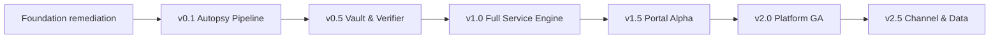

# Re-baselined roadmap through Nigeria v2.5

Baseline start: 2026-08-08. Dates are planning windows, not promises. Dependencies and exit evidence govern release; a failed gate stops promotion. Commercial activation is independent and never inferred from code completion.

## Dependency spine

## Planning windows and exits

| Release    | Provisional window | Technical vertical slices                                                                                                                             | Technical exit                                                                                                   | Commercial activation                                                                         |
| ---------- | ------------------ | ----------------------------------------------------------------------------------------------------------------------------------------------------- | ---------------------------------------------------------------------------------------------------------------- | --------------------------------------------------------------------------------------------- |
| Foundation | Aug-Sep 2026       | Organisations/memberships/RLS; permissions; migrations/exact money/time; security middleware; flags; jobs/outbox; adapters; audit anchor; CI/runbooks | Tenant negative tests, migration proof, critical CI green, dev adapters fail outside dev                         | None                                                                                          |
| v0.1       | Sep-Nov 2026       | Governed engagement/conflict/entitlement; secure intake/quarantine; durable OCR/extraction; citation review; fatal state; Autopsy render/sign         | E2E with real DB/storage/jobs; quality/injection gates; visual render evidence; no P0/P1                         | Five real autopsies within agreed SLA remains a business gate; do not fabricate               |
| v0.5       | Nov 2026-Feb 2027  | Vault versions/renewals; evidence approval; exact BOQ; SBD/rule packs; operational privacy/retention; full package manifest                           | BOQ seeded errors 100%; renewal/provider reconciliation; rule-pack approval; DSR/retention tests                 | First retainer/Vault use is measured outside software evidence                                |
| v1.0       | Feb-May 2027       | Capability grounding; draft/revisions/diffs; red team; prequal; complete assembly; immutable audit anchor; backup/restore/escalation                  | Unsupported claims rejected 100%; restore/rollback drill; reference packages visually pass; human QA enforced    | Paid engagement/retainer/conversion/on-time/disqualification measures remain real-world gates |
| v1.5       | May-Aug 2027       | Client organisations/portal, secure exchange, tasks/deadlines/history, MFA/RBAC, low-bandwidth/a11y                                                   | WCAG 2.2 AA critical flows; cross-tenant E2E; 99.5% SLO instrumentation; new uploads quarantined                 | Alpha cohort, consent/support readiness approved by owner                                     |
| v2.0       | Aug-Dec 2027       | Self-service order/intake, client Vault actions, reviewer queues, billing/entitlement/metering, approved auto-confirm, operations/monitoring          | 99.9% target instrumentation; load/resilience; payment reconciliation; auto-confirm graduation; no high/critical | Price book/products/provider agreements/support capacity and metrics approved                 |
| v2.5       | Dec 2027-Mar 2028  | Partner tenancy/delegation, branding boundary, co-sign, partner reporting; consent-controlled benchmarks/defect report pipeline                       | Partner isolation/ownership/co-sign E2E; privacy attack/withdrawal tests; flags default off; reproducible report | Two/three partners, channel/revenue mix or any other BP gates are measured, never invented    |

Windows must be re-estimated after Foundation using team capacity, infrastructure and risk. Production deployment also requires explicit authorised target/credentials/budget.

## Vertical-slice backlog

### Foundation

1. `FND-01` Create organisation/membership/grant/partner/break-glass model and tenant context.
2. `FND-02` Backfill tenant IDs; force RLS; tenant-scope storage/search/jobs.
3. `FND-03` Introduce migration history, exact money/time and closed/versioned state primitives.
4. `FND-04` Implement permission policy and denial/access audit tests.
5. `FND-05` Add durable jobs/outbox/idempotency/dead-letter operations.
6. `FND-06` Add provider adapters, environment safety and server feature flags.
7. `FND-07` Add immutable audit anchoring, redacted observability, SBOM/scanning and ops runbooks.

### v0.1

1. `AUT-01` Onboarding, privacy/NDA, tender/lot and same-lot conflict gate.
2. `AUT-02` Order/entitlement gate and engagement state transaction.
3. `AUT-03` Resumable intake, signature/MIME/hash/duplicate/version/addendum/malware/quarantine.
4. `AUT-04` Durable parse/OCR/classification/extraction with progress/recovery.
5. `AUT-05` Resolvable citations and keyboard human confirmation queue.
6. `AUT-06` Requirement/defect/remediation/fatal blocker with independent reclassification.
7. `AUT-07` Autopsy assembly, render, visual QA, sign/export and evaluation harness.

### v0.5

1. `VLT-01` Vault artefact/version/verification/approval/usage/expiry.
2. `VLT-02` Renewal jobs and reconciled email/WhatsApp notifications.
3. `BOQ-01` Lossless workbook intake and exact verifier with tender/Nigeria rule overlay.
4. `COR-01` Authorised versioned BPP SBD corpus and agency annotations.
5. `PRV-01` RoPA/DPA/subprocessor/transfer/DPIA/DSR/retention/hold workflows.

### v1.0

1. `CAP-01` Capability fact schema, evidence approval/validity/restriction/usage.
2. `DRF-01` Grounded drafting with provenance, placeholders, version/diff/comment/approval.
3. `RED-01` Scheduled red-team rubric and remediation loop.
4. `PKG-01` Prescribed template assembly, DOCX/PDF/ZIP manifests, render QA and immutable sign-off.
5. `OPS-01` Restore, rollback, incident, audit anchor and release handover evidence.

### v1.5-v2.5

1. `PRT-01` Role-specific client portal and secure exchange.
2. `ORD-01` Price book, orders, subscriptions, invoices/payments, usage/entitlements.
3. `OPS-02` Reviewer/admin queues, provider/security/SLA/evaluation operations.
4. `ATM-01` Narrow auto-confirm graduation/rollback framework.
5. `PAR-01` Partner/client relationship, delegated roles, branding boundary, co-sign and ownership.
6. `ANL-01` Consent ledger, privacy-safe cohorts, suppression/differencing/withdrawal and reproducible benchmark release.

## Feature flags and commercial separation

| Capability                       | Default through build | Activation prerequisites                                             |
| -------------------------------- | --------------------- | -------------------------------------------------------------------- |
| Client self-service mutation     | Off                   | v1.5 security/a11y/support evidence and tenant allow-list            |
| Auto-confirm                     | Off                   | Field-specific >=99% unseen precision memo and rollback alerts       |
| Payment charging                 | Off/test adapter      | Provider contract, reconciliation/finance approval and incident path |
| WhatsApp intake                  | Off                   | Approved BSP, consent/sender binding, archive/DPA/transfer controls  |
| Partner management/branding      | Off                   | Partner isolation/ownership/co-sign tests and signed agreement       |
| Benchmarks/public defect report  | Off                   | DPIA/legal approval, consent/cohort/privacy tests and release review |
| Restricted/in-country mode claim | Off                   | Actual audited routing/storage/model stack and provider evidence     |

## Release governance

Each release candidate reconciles `REQUIREMENTS_TRACEABILITY.md`, retains CI/evaluation/security/a11y/ops artefacts, renders and visually inspects generated documents, updates migrations/SBOM/runbooks/release notes, and receives product, security/privacy, QA and operations sign-off. An unresolved P0/P1, disabled critical test, development adapter in production, missing backup/rollback or unverified deployment blocks release.

## Beyond v2.5

GCC/Arabic localisation, government e-submission, tender scraping/discovery product, native mobile, marketplace/brokering and award prediction remain deferred. They do not constrain this roadmap except provider/rule-pack portability.
