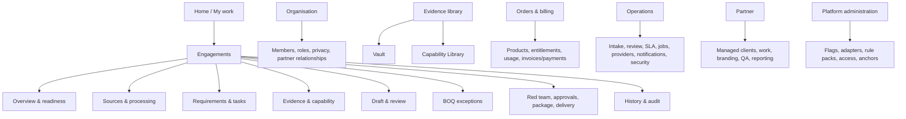

# UX specification

Status: design contract. Existing pages are useful implementation inputs, not proof that the target UX has passed visual, responsive or accessibility QA.

## Experience principles

- Calm, credible, evidence-led; no “AI magic” language.
- The first visible answer is current state, reason, owner and next safe action.
- Fatal, blocked, expired, quarantined and unverified states are never communicated by colour alone.
- The source, version, confidence, evidence and human decision are one interaction away.
- Deadline pressure shortens decisions, not controls.
- Desktop is the primary workbench; tablet/mobile browser supports status, approval, capture and recovery. No native mobile app.

## Role goals

| Role cluster              | Primary goals                                                                                   |
| ------------------------- | ----------------------------------------------------------------------------------------------- |
| Client owner/admin        | Onboard, govern people/privacy, order, see risk/cost/usage, approve/export                      |
| Bid manager/contributor   | Intake tender, own requirements/tasks, supply evidence, resolve gaps, edit grounded drafts      |
| Client approver/auditor   | Independently review change/evidence/sign-off trail without accidental mutation                 |
| Valo analyst/QA           | Clear high-volume queues, compare sources, adjudicate defects, enforce evidence/fatal gates     |
| Operations/platform admin | Resolve provider/job/SLA/billing/security exceptions without standing content access            |
| Partner admin/analyst     | Manage delegated clients and work, apply allowed branding, co-sign under visible responsibility |

## Core journeys

### New engagement

`Organisation setup -> identity/MFA -> privacy/NDA -> tender+lot -> conflict result -> product/entitlement -> upload -> quarantine/processing -> requirement review -> assignments -> evidence -> drafting/BOQ -> red team -> independent approvals -> render/visual QA -> sign -> export/delivery`

Every step supports save/resume and shows which actions are safe while background work continues.

### Addendum or replacement

`New version detected -> impact summary -> affected requirements/drafts/BOQ/packages reopened -> owners notified -> changed citations reviewed -> approvals re-run -> new immutable package version`.

The user can compare old/new source and see why an apparently finished task reopened.

### Expiring evidence

`Renewal radar -> owner/lead time -> upload replacement to quarantine -> verification -> approval -> associations migrate explicitly -> old version retained/superseded -> affected package readiness recalculated`.

### Fatal defect

`Defect opened -> package blocked -> remediation/evidence -> re-test -> propose reclassification or resolution -> independent approval -> readiness recomputed`. There is no “override and continue.”

### Provider/connection failure

`Visible partial progress -> retained upload/job ID -> safe-to-close explanation -> automatic retry or operator task -> notification on resolution -> no duplicate side effect`.

## Information architecture



Navigation is permission-derived. Direct URLs return a non-revealing forbidden/not-found result as policy requires; they never render data then hide it.

## Screen inventory

| Area             | Screen                                         | Essential states/actions                                                      |
| ---------------- | ---------------------------------------------- | ----------------------------------------------------------------------------- |
| Access           | Sign in/MFA/recovery                           | expired link, rate limit, disabled account, step-up                           |
| Onboarding       | Organisation + legal/privacy                   | draft, validation, identity pending, NDA/privacy version                      |
| People           | Members/roles/grants                           | invite, expiry, delegated scope, revoke, access review                        |
| Home             | My work/deadlines/renewals                     | role-specific, offline cache age, next action                                 |
| Engagement       | List/create/detail                             | conflict/entitlement gate, filters, saved views                               |
| Sources          | Uploads/versions/addenda                       | resumable progress, quarantine, duplicate, corrupt/password, retry            |
| Processing       | Job timeline                                   | stage, percentage/indeterminate, cost visibility by role, recovery            |
| Requirements     | Review queue/source compare                    | keyboard commands, confidence, citation, bulk validation, version conflict    |
| Tasks            | Board/list                                     | owner, due date, dependency, escalation, reopen                               |
| Evidence         | Requirement mapping                            | validity, restriction, provenance, approve/reject                             |
| Vault            | Artefacts/versions/renewals                    | quarantine, verification, usage, expiry, retention                            |
| Capability       | Claims/facts/evidence                          | claimable/block reason, restrictions, approval/usage history                  |
| Draft            | Section editor/diff/comments                   | evidence chips, unresolved placeholders, stale edits                          |
| BOQ              | Workbook map/exceptions                        | formula/display, hidden cells, rounding/tax rule version, no price suggestion |
| Readiness        | Gate dashboard                                 | pass/block/warn reason and authoritative recompute time                       |
| Red team         | Findings queue                                 | rubric/citation, disposition, independent fatal action                        |
| Package          | Inputs/manifest/render QA/sign                 | immutable versions, preview, checklist, approvals, expiring export            |
| Billing          | Products/order/entitlement/usage               | price-book version, pending reconciliation, no hard-coded prices              |
| Operations       | Multi-queue console                            | tenant-redacted metadata first, job replay, SLA/provider alerts               |
| Privacy/security | DSR, consent, hold, break-glass, access review | deadlines, dual control, immutable history                                    |
| Partner          | Clients/team/branding/QA/reporting             | ownership boundaries, co-sign duty, flag state                                |
| Rule packs       | Source/approval/effective versions             | diff, tests, sign, supersede/rollback                                         |

Observed implementation has landing/sign-in, dashboard, clients/client detail, projects/project detail tabs, SBD corpus/detail and settings. The target inventory is broader.

## Workbench wireframe

```text
+--------------------------------------------------------------------------------+
| Valo | Organisation v | Search | Help | Connection | User/MFA                  |
+----------------------+---------------------------------------------------------+
| My work              | Tender REF / Lot 2                Deadline: 3d 04h      |
| Engagements          | BLOCKED - 2 fatal defects         Last recompute: 10:42 |
| Evidence library     +---------------------------------------------------------+
| Orders & billing     | [Overview][Sources][Requirements][Evidence][Draft] ...  |
| Partner / Operations +---------------------------------------------------------+
|                      | Next safe action                                        |
|                      | Upload renewed PENCOM evidence; owner: Ada; due today   |
|                      +--------------------------+------------------------------+
|                      | Requirement queue        | Source comparison            |
|                      | [filters/saved view]     | Page image + exact citation  |
|                      | > selected item          | highlighted coordinates      |
|                      | status/owner/confidence  | version/addendum notice      |
|                      +--------------------------+------------------------------+
|                      | [Reject] [Edit] [Confirm] (permission/context aware)    |
+----------------------+---------------------------------------------------------+
```

## Mobile approval wireframe

```text
[Valo] Tender REF / Lot 2
BLOCKED: fatal defect open
Deadline 3d 04h

Next action
Review renewed certificate

Evidence status: pending approval
Issuer / dates / verification
[View source] [View change]

[Reject with reason]
[Approve]  -> requires step-up and confirmation

Offline: approval disabled; draft reason saved locally without document content.
```

## Review interaction model

Keyboard: `j/k` next/previous, `enter` open source, `c` confirm, `e` edit, `r` reject, with visible shortcuts and no single-key activation while typing. Destructive/material actions require explicit reason and confirmation. Bulk action is limited to same action, compatible state and non-fatal low-risk class; server revalidates every selected ID and returns itemised success/failure.

## Design system

### Tokens

- Typography: Inter/system sans for UI; Source Serif or approved document font only in rendered reports. Base 16px, line height >= 1.5; tabular numerals for dates/money.
- Spacing: 4px scale; minimum 44x44px pointer target where feasible; dense desktop tables provide a comfortable mode.
- Colour: neutral ink/slate canvas; calm blue action; green pass; amber attention; red blocked/fatal; purple review. All semantic states include icon + label + explanation and meet contrast.
- Focus: 2px high-contrast visible ring with offset, never removed.
- Radius/shadow: restrained; hierarchy comes from spacing/type/borders, not decorative cards.

### Components

App shell, breadcrumb, tenant switcher, deadline clock, readiness banner, status chip, reason panel, evidence/citation chip, source viewer, diff, version badge, data grid, filter builder, bulk action bar, task card, stepper, upload manager, job timeline, approval panel, empty/error/offline panel, toast + persistent notification centre, audit timeline, rule-pack badge and accessible chart/table pair.

## Content rules

Use “suggested”, “confirmed by”, “blocked because”, “evidence expires”, and “source page/clause”. Never say “AI verified”, “guaranteed compliant”, “will win”, or “safe” without named deterministic/human basis. Risk is “controllable-defect risk”, not award probability. Money checks explain that Valo did not create the client's rates.

## Low-bandwidth design

- Route bundles and data are paginated/lazy; source thumbnails load before high-resolution pages.
- Uploads are resumable with chunk hash, retry/backoff and visible server receipt; never restart a large file silently.
- Polling backs off and uses last-known state; background jobs say “safe to close.”
- Tables use server filters/sorts; avoid loading complete document text.
- Cache only non-sensitive shell/reference data; never retain restricted documents in offline browser storage.
- Mobile screenshots/previews are compressed and user-triggered; downloads show size first.
- Every partial failure names retained work and recovery action.

## WCAG 2.2 AA acceptance

- Semantic landmarks/headings, skip link, labelled controls, error summary and inline errors.
- Complete keyboard operation, logical focus order, focus restoration and no keyboard trap.
- Status/progress changes announced through appropriate live regions without noise.
- Reflow at 320 CSS px; zoom to 200%; text spacing remains usable; no essential horizontal scroll except true data grids with accessible alternatives.
- Contrast, non-colour semantics, reduced motion, target size, accessible authentication and consistent help.
- Data grids expose headers/sort/selection; charts have equivalent tables/summaries.
- Source page images have document/page context; OCR text is available only where access policy permits and marked as machine-derived.

Verification requires automated axe checks plus manual keyboard, NVDA/Chrome on Windows and at least one mobile screen reader/browser pass on critical journeys. No pass is claimed in this specification.

## Responsive visual QA matrix

Test at 360x800, 768x1024, 1024x768, 1440x900 and 1920x1080, plus 200% zoom. Capture sign-in, dashboard, upload/quarantine, requirement source compare, evidence approval, BOQ exception, fatal block, package sign-off, operations queue and partner branding. Inspect loading, empty, error, partial, expired, blocked and offline states.
